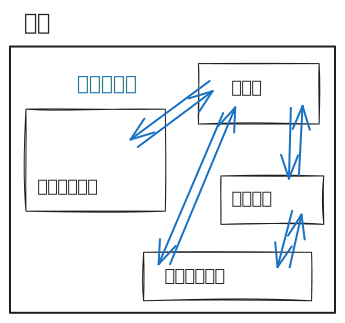
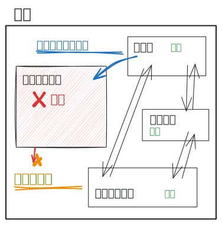

# 浏览器进程模型详解

## 前置知识

### 进程与线程

进程与线程应该算是计算机中的基础概念了，这里简单提一下，不过多介绍。

进程（process）是程序的一次运行活动，是系统进行资源分配和调度的基本单位。进程有自己独立的内存空间，进程与进程之间相互独立、互不干扰。

线程（thread）是进程的实际运作单位，是系统能够进行运算调度的最小单位。一条线程就是进程中的一个控制流，一个进程可以有一个或多个线程，多个线程可以并行执行多个任务。每个进程至少要有一个主线程，主线程可以调度其他线程。

> [!note]
>
> 如果实在不理解，可以参考下面的比喻：
>
> - 进程是一个工厂，工厂有它的独立资源
> - 工厂之间相互独立
> - 线程是工厂中的工人，多个工人协作完成任务
> - 工厂内有一个或多个工人
> - 工人之间共享空间
>
> | 比喻                   | 实际                                                                       |
> | ---------------------- | -------------------------------------------------------------------------- |
> | 工厂的资源             | 系统分配的内存（独立的一块内存）                                           |
> | 工厂之间的相互独立     | 进程之间相互独立                                                           |
> | 多个工人协作完成任务   | 多个线程在进程中协作完成任务                                               |
> | 工厂内有一个或多个工人 | 一个进程由一个或多个线程组成                                               |
> | 工人之间共享空间       | 同一进程下的各个线程之间共享程序的内存空间 （包括代码段、数据集、堆等） |

### 多线程模型与多进程模型

~~假设我要玩原神~~ 考虑一个庞大的程序，例如原神。在运行原神的时候至少要做这么几件事：

- 网络通信
- 场景渲染
- 用户操作监听
- 战斗数值计算
- ……

我们自然而然想到可以将其设计成单进程多线程的结构：

但是这样做有个问题，所有的线程共享同一片内存空间，一旦某个线程崩溃，错误会「传导」到整个进程中，导致全盘崩溃。因此，我们可以考虑采用多个进程来运行：

程序启动时会启动一个主进程，主进程负责启动和管理子进程，各个功能模块通过以子进程的模式运行。这样，程序的各个部分都有了自己独立的内存空间，相互之间进行通信。各个功能模块也可以在内部使用多线程来处理更复杂的任务。同时，如果其中某个功能模块崩溃，也不会影响到其他模块。同时，主进程还可以尝试重启崩溃的子进程。这样一来就大大增强了程序的健壮性。

但是多进程也是有代价的。多进程模式下功能模块之间的通信会更加复杂，这会带来一定的性能开销。

总结一下就是：

- 对资源的管理和保护要求高，相对不关心开销和效率时，使用多进程。
- 要求效率高，频繁切换时，资源的保护管理要求不是很高时，使用多线程。

## 浏览器进程模型

浏览器是一个**多进程多线程**的应用程序。

浏览器需要解析和运行来自网络的不可控内容，对资源的保护和管理要求较高，为了保证安全、避免连环崩溃，采用了多进程模型。这样有以下优势：

- 避免单个页面崩溃影响整个浏览器；
- 避免第三方插件崩溃影响整个浏览器；
- 多进程充分利用多核优势；
- 方便使用沙盒模型隔离插件等进程，提高浏览器稳定性。

## 参考资料

[知乎 @codebird：面试必考 | 进程和线程的区别](https://zhuanlan.zhihu.com/p/114453309)

[SegmentFault @撒网要见鱼：从浏览器多进程到JS单线程，JS运行机制最全面的一次梳理](https://segmentfault.com/a/1190000012925872#item-4-1)
