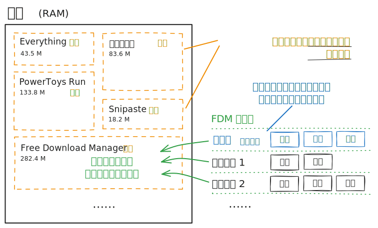
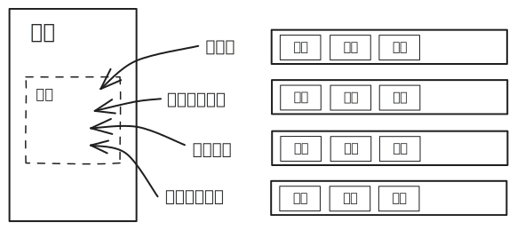
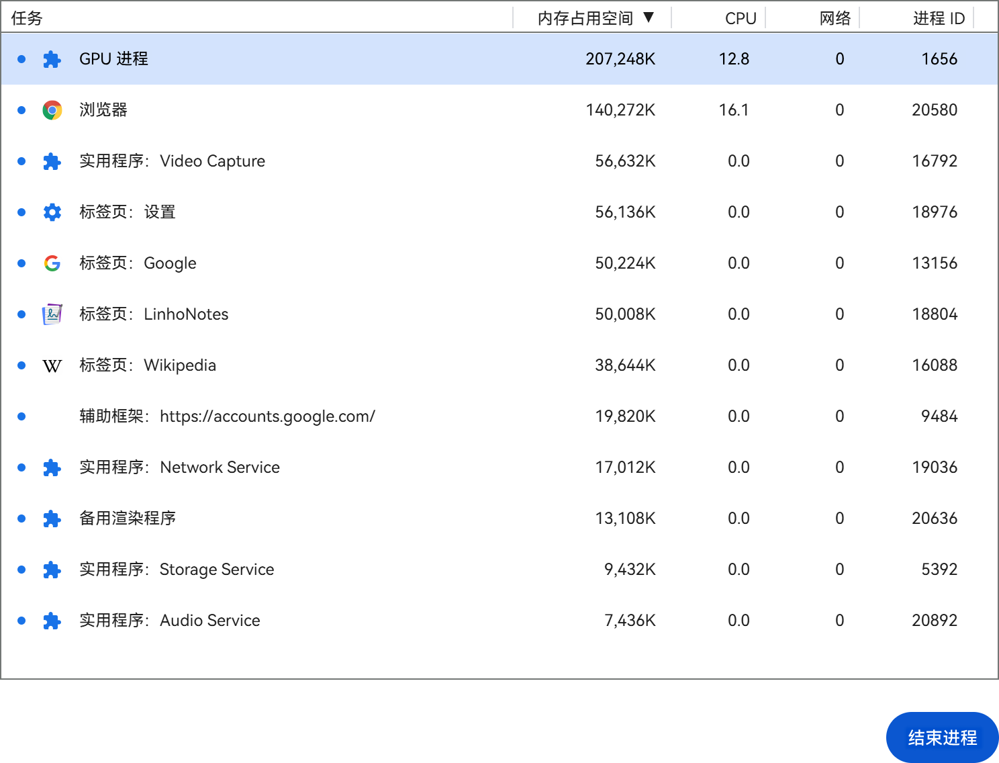
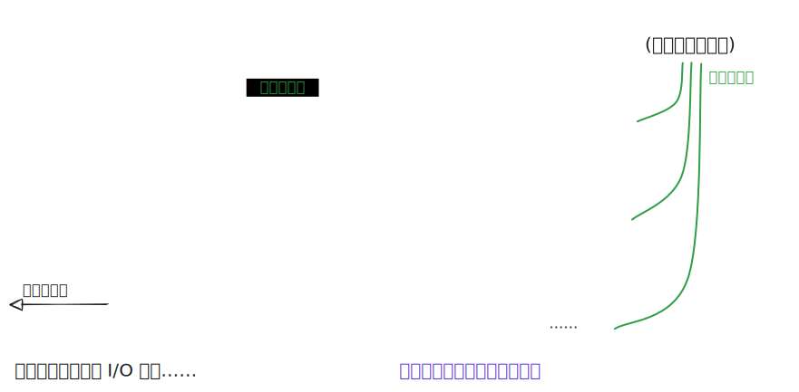
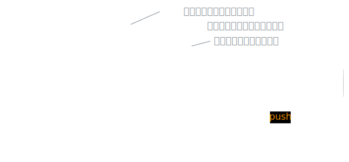
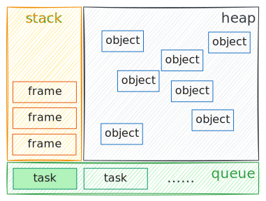
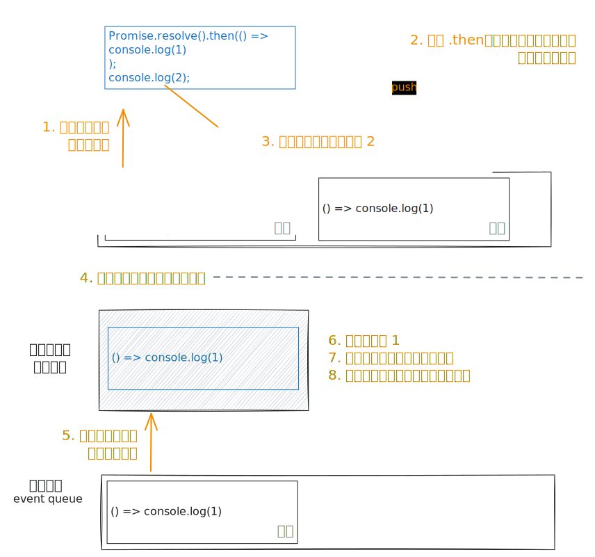
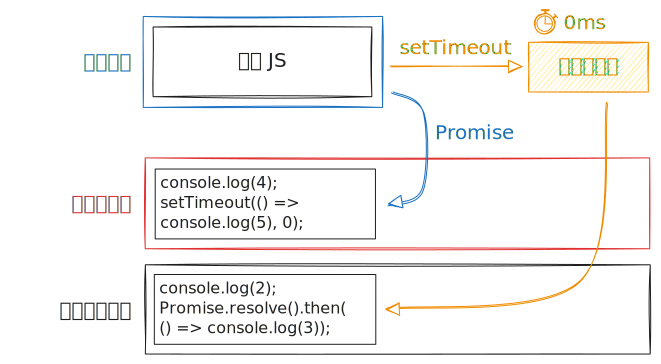
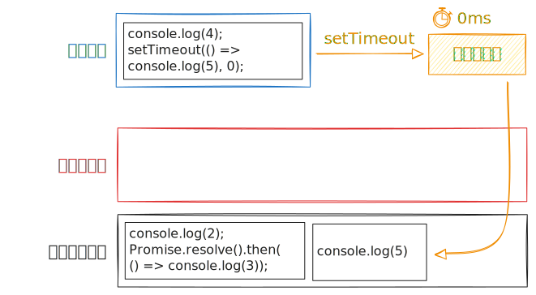

# 浏览器进程模型、事件循环与异步

## 前置知识

### 进程与线程

进程与线程应该算是计算机中的基础概念了，这里简单提一下，不过多介绍。

进程（process）是程序的一次运行活动，是系统进行资源分配和调度的基本单位。进程有自己独立的内存空间，进程与进程之间相互独立、互不干扰。

线程（thread）是进程的实际运作单位，是系统能够进行运算调度的最小单位。一条线程就是进程中的一个控制流，一个进程可以有一个或多个线程，多个线程可以并行执行多个任务。每个进程至少要有一个主线程，主线程可以调度其他线程。



> [!note]
>
> 如果实在不理解，可以参考下面的比喻[^1]：
>
> | 比喻             | 对应进程与线程                             |
> | ---------------- | ------------------------------------------ |
> | 工厂有独立资源   | 进程有系统分配的独立内存                   |
> | 工厂之间相互独立 | 进程之间相互独立，互不影响                 |
> | 工厂中有工人工作 | 进程中有至少一个线程执行任务               |
> | 工人之间共享空间 | 同一进程下的各个线程之间共享进程的内存空间 |

### 多线程模型与多进程模型

~~假设我要玩原神~~ 考虑一个庞大的程序，例如某个二字游戏。在运行原神的时候至少要做这么几件事：

- 网络通信
- 场景渲染
- 用户操作监听
- 战斗数值计算
- ……

我们自然而然想到可以将其设计成单进程多线程的结构：



但是这样做有个问题，所有的线程共享同一片内存空间，一旦某个线程崩溃，错误会「传导」到整个进程中，导致全盘崩溃。因此，我们可以考虑采用多个进程来运行：


程序启动时会启动一个主进程，主进程负责启动和管理子进程，各个功能模块通过以子进程的模式运行。这样，程序的各个部分都有了自己独立的内存空间，相互之间进行通信。各个功能模块也可以在内部使用多线程来处理更复杂的任务。同时，如果其中某个功能模块崩溃，也不会影响到其他模块。同时，主进程还可以尝试重启崩溃的子进程。这样一来就大大增强了程序的健壮性。


但是多进程也是有代价的。多进程模式下功能模块之间的通信会更加复杂，这会带来一定的性能开销。

总结一下就是：

- 对资源的管理和保护要求高，相对不关心开销和效率时，使用多进程。
- 要求效率高，频繁切换时，资源的保护管理要求不是很高时，使用多线程。

## 浏览器进程模型

### 整体结构

线代浏览器是**多进程多线程**的应用程序。

浏览器需要解析和运行来自网络的不可控内容，对资源的保护和管理要求较高，因此采用了多进程模型。这样可以：

- 避免单个页面崩溃影响整个浏览器；
- 避免第三方插件崩溃影响整个浏览器；
- 多进程充分利用多核优势；
- 方便使用沙盒模型隔离插件等进程，提高浏览器稳定性。

你可以在浏览器右上角菜单 → 更多工具 → 任务管理器这里打开浏览器的任务管理器，其中可以看到浏览器的所有进程。



其中最重要的（或者说我们比较关心的）几个进程有：

- 浏览器进程

  负责启动和管理子进程，显示标签栏、地址栏等浏览器界面与交互。

- 网络进程

  负责加载网络资源。网络进程内部会启动多个线程来处理不同的网络任务。

- 渲染进程 <T purple>最重要的</T>

  负责解析页面 HTML、CSS，运行 JS，处理用户交互等。

  默认情况下，浏览器会为每个标签页开启一个新的渲染进程，以保证不同的标签页之间互不影响。此机制称为 Process-per-tab。

  > 由于 Process-per-tab 模式太吃内存，未来 Chromium 可能会转向 Site-per-process 模式。详见 [Chromium Docs: Process Model and Site Isolation](https://chromium.googlesource.com/chromium/src/+/main/docs/process_model_and_site_isolation.md#Modes-and-Availability)。

  此外，同源 `iframe` 与父页面共用渲染进程，不同源 `iframe` 为单独的渲染进程。

总结成一张图就是：



作为前端，我们肯定最关心渲染进程，因为前端做的一切都是在跟渲染进程打交道。

> 不同平台上浏览器的进程结构也会有一定的差别，例如移动端上，GPU 渲染部分不再独立为 GPU 进程，而是作为浏览器进程的一个线程。此外，随着版本更新，进程模型也会有变化，例如曾经网络通信部分没有独立为进程，而是也运行在浏览器进程下[^2]。

### 渲染进程

渲染进程的主线程一般成为 **渲染主线程**，这是渲染进程中最繁忙的进程，其工作包括：

- 解析 HTML（生成 DOM 树）
- 解析 CSS（生成 CSSOM 树）
- 计算样式
- 布局（生成 Layout 树）
- 分层、生成绘制指令
- 执行 JS
- ……

> [!note]
>
> **为什么不用多线程，在处理 HTML/CSS 时同时运行 JS？**
>
> 因为 JS 也可以增删改查 DOM 树和布局树，这就涉及到多线程编程中的「变量锁」「原子化操作」等问题。而 JS 设计之初的定位就只是一个简单的脚本语言，因此也没有提供与多线程操作有关的机制，那么最简单的办法就是直接采用单线程。
>
> 举一些实际的例子就是，如果二者同时执行，可能会出现这样的情况：
>
> - JS 想读取某个节点的信息，但是还没还没解析到该节点的 HTML。
> - 或者 JS 读取了某元素的宽度，稍后另一个线程上解析 CSS 时却发现该元素被设为了 `display: none`。
>
> ---
>
> 此外，有一些文章[^3]提到「GUI 渲染线程与 JS 引擎线程互斥」，即认为渲染主线程实际上为两个线程，一个 HTML/CSS 解析渲染线程和一个 JS 执行线程，二者互斥，一个执行时另一个挂起。但是笔者没有找到可靠资料证实这一点。反倒是在一篇知乎回答[^4]中，有大神直接通过修改 Chromium 源码打印日志得到 DOM 解析与 JS 渲染所在进程的 TID 相同，即不存在两个线程分别处理 HTML/CSS 和 JS，而是均由渲染主线程处理。

这就引入一个问题：在**单线程**的大前提下，如何调度这些任务？例如当正在运行 JS 时，某个事件监听器或者计时器触发了，如何在及时响应？我们都知道这是一种叫做「异步」的模式，但异步具体是如何运行的？

## 事件循环与异步

### 事件循环



渲染主线程通过任务队列（task queue）管理任务：

- 渲染主线程会进入一个无限循环。每一次循环会检查消息队列中是否有任务存在。如果有，就取出第一个任务执行，执行完一个后进入下一次循环；如果没有，则进入休眠状态。
- 当前运行的任务或其他线程（包括其他进程的线程）可以随时向消息队列添加任务。新任务会加到消息队列的末尾。在添加新任务时，如果主线程是休眠状态，则会将其唤醒以继续循环拿取任务。

这个循环称为**事件循环**（event loop）。

> [!note]
>
> **一点题外话**
>
> W3C 标准中的名称是任务队列（task queue）和事件循环（event loop），但 Chromium 源码中使用的名称是消息队列（message queue）和消息循环（message loop）。只是名称上的区别，实际上是同一个东西。
>
> 此外，下面是 Chromium 源码中的死循环代码：
>
> ```cpp:line-numbers=34 [base/message_loop/message_pump_default.cc]{4,9}
> void MessagePumpDefault::Run(Delegate* delegate) {
>   AutoReset<bool> auto_reset_keep_running(&keep_running_, true);
>
>   for (;;) {
> #if BUILDFLAG(IS_APPLE)
>     apple::ScopedNSAutoreleasePool autorelease_pool;
> #endif
>
>     Delegate::NextWorkInfo next_work_info = delegate->DoWork();
>     bool has_more_immediate_work = next_work_info.is_immediate();
> ```
>
> 你可以在 [这里](https://source.chromium.org/chromium/chromium/src/+/main:base/message_loop/message_pump_default.cc) 看到完整代码。

我们可以进一步，把栈和堆也画进来[^5]：



渲染主线程在消息队列中按顺序执行任务（task），运行当前任务过程会在调用栈中产生帧（frame），当所有帧都清空，该任务执行完毕，继续执行下一个任务。运行过程产生的对象存放在堆（heap）中。

举个例子，对于下面这段代码：

```js
Promise.resolve().then(() => console.log(1));
console.log(2);
```

假设此时事件队列为空。接下来：

1. 这两行作为全局代码，以一个整体任务进入事件队列，被渲染主线程拿出来运行；
2. 通过 .then，匿名函数 `() => console.log(1)` **被包装为任务**并加入事件队列；
3. 继续执行，控制台输出 2；
4. 当前任务执行完成，弹出队列；
5. 读入执行队列中的下一个任务（`() => console.log(1)`）；
6. 控制台输出 1；
7. 当前任务执行完成，退出队列；
8. 如还有任务，继续执行；否则休眠。



> [!note]
>
> 称「被包装为任务」是因为任务的实质是 C++ 的结构体。JS 的函数需要经过包装才能变成任务。

### 「永不阻塞」？

由于异步机制的存在，所有耗时的场景基本都以异步形式实现，例如网络请求、定时器、用户交互监听等等。因此，渲染主线程几乎不会为了等待什么而阻塞。所以，JS 有时也被称为「永不阻塞」的语言。

> 当然也有一些例外，例如 `alert()`、`confirm()`、`prompt()` 等早期设计的全局方法。这些方法弹出模态框时，渲染主线程是阻塞的。

**可是这里的「阻塞」指的是「等待」**——即引擎不会坐着干等着某些操作完成。但是有时候我们说「阻塞」是另外一个意思：被当前任务堵住。由于渲染主线程是单线程的，如果当前 JS 执行的任务花费时间太久，网页图形渲染（本质上也是任务）就没法执行，呈现给用户的效果就是页面显示和动画卡顿。

你可以用下面的 snippet 尝试一下：

```html
<script>
  function sleep(ms) {
    const target = Date.now() + ms;
    while (Date.now() < target);
  }
</script>
<button onclick="sleep(5000)">Sleep</button>
<p>
  Lorem ipsum dolor sit amet consectetur, adipisicing elit. Harum, nostrum!
  Recusandae consectetur quasi dolor voluptas dolores odit, ratione nesciunt
  itaque aperiam ea nemo cum perferendis dolore eos libero. Possimus, sed.
</p>
```

在点击按钮之后，JS 会持续运行 5 秒，这 5 秒内渲染主线程会被 JS 的任务占用，整个页面呈现在用户面前就是「卡死」的状态：页面内容停止更新，且不会对操作产生反应。你可以继续自行扩展这个样例。

所以，如果有长耗时的同步操作，应当将其分割（chunking）到多个任务，或者直接丢掉 web worker 线程去。

> [!note]
>
> **Worker 与 shared worker 的线程结构**
>
> Worker 和 shared worker 为 JS 提供了真正的多线程能力。Worker 线程运行在渲染进程下，而 shared worker 由于不仅属于某个标签页，浏览器会专门开一个进程来处理。

### 任务优先级与多队列

任务有优先级吗？按理来说是有的。例如，当用户交互与倒计时结束均发生时，应该先执行哪个？

首先需要明确的时，队列是严格先进先出的，不存在「插队」的行为。因此，异步事件的优先级是通过维护多个事件队列实现的。W3C 标准中规定，各浏览器**至少**要维护一个「**微任务队列**」（microtask queue）并优先执行微任务队列的任务[^6]，至于其他任务，浏览器实现可以自行归类并放置在不同队列中。

当前 Chromium 的实现中至少包含了如下队列：

- 微任务队列：用户存放需要最快执行的任务，优先级最高
- 交互队列：用于存放用户操作后产生的事件处理任务，优先级高
- 延时队列：用于存放计时器到达后的回调任务，优先级中

不少「面试题」中常常提到的 `Promise` 优先于 `setTimeout` 的原因就在这里：**`Promise` 产生的异步任务是添加到微任务队列的，因此优先执行**。

> [!note]
>
> **添加任务到微任务队列的主要方式**
>
> - `queueMicrotask()` 全局方法接受一个回调函数作为参数，直接将其添加到微队列
> - `Promise` 挂载的回调在 resolve 时加入微队列
> - `MutationObserver` 产生的事件回调加入微队列

我们不妨就研究一个这样的例子：

```js
console.log(1);
setTimeout(() => {
  console.log(2);
  Promise.resolve().then(() => console.log(3));
}, 0);
Promise.resolve().then(() => {
  console.log(4);
  setTimeout(() => console.log(5), 0);
}, 0);
console.log(6);
```

你可以先思考一下输出是什么。答案是 %%`1 6 4 2 3 5`%%。

下面我们来分析一下。首先执行全局的同步代码。

1. 首先打印 `1`，
2. 然后 `setTimeout` 调用计时器线程，计时器线程（等待 0ms，相当于立即）将回调包装为任务推入计时任务队列，
3. 接着 `Promise` 将回调推入微任务队列，
4. 最后打印 `6`



此时全局 JS 执行完毕，任务结束。优先处理微任务队列，`Promise` 的回调优先执行，输出 `4`，并通过计时器线程将新的回调推入计时器队列。



接着当前任务退出，取出计时器队列的第一个任务，输出 `2`，再用 `Promise` 将新的回调推入微任务队列。


接着当前任务退出，优先处理微任务队列，输出 `3`；然后处理计时器队列，输出 `5`。程序结束。因此，最后的输出是 `1 6 4 2 3 5`。

## 参考资料

[^1]: [知乎 @codebird：面试必考 | 进程和线程的区别](https://zhuanlan.zhihu.com/p/114453309)

[^2]: [Chrome for Developers: Inside look at modern web browser](https://developer.chrome.com/blog/inside-browser-part1)

[^3]: [SegmentFault @撒网要见鱼：从浏览器多进程到JS单线程，JS运行机制最全面的一次梳理](https://segmentfault.com/a/1190000012925872#item-4-1)

[^4]: [知乎 @徐鹏跃 在问题「浏览器UI线程和JS线程是同一个线程吗」下的回答](https://www.zhihu.com/question/264253488/answer/2160885082)

[^5]: [MDN: 事件循环](https://developer.mozilla.org/zh-CN/docs/Web/JavaScript/Event_loop)

[^6]: [HTML Standard: Microtask](https://html.spec.whatwg.org/multipage/webappapis.html#perform-a-microtask-checkpoint)
