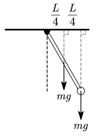

# 1.3 刚体力学基础

## 刚体

- 不能变形的物体称为刚体，是一种理想模型
- 刚体的运动形式可分解为平动和转动，转动可用 $\theta,\omega,\alpha$ 描述
- 大学物理中只研究刚体的定轴转动

## 转动惯量 $J$

- 刚体绕定轴转动时惯性的量度，由质量对轴的分布决定
- 转动惯量等于各质点质量乘以距离的平方再求和
- 对于质点系，$J=\sum m_ir_i^2$；对于连续体，$J=\int r^2{\rm d}m$
- 质量分布离轴越远，转动惯量越大。等质量的空心物体比实心物体转动惯量大

常见物体的转动惯量（要求记忆，至少记住前四个）：

|            形状            |     转动惯量      |
| :------------------------: | :---------------: |
| 圆环，空心圆柱（对中心轴） |      $MR^2$       |
| 圆盘，实心圆柱（对中心轴） |  $\dfrac12MR^2$   |
|       细杆（对中点）       | $\dfrac1{12}ML^2$ |
|       细杆（对端点）       |  $\dfrac13ML^2$   |
|     实心球体（对直径）     |  $\dfrac25MR^2$   |
|     空心球壳（对直径）     |  $\dfrac23MR^2$   |

**平行轴定理：刚体对于任意轴的转动惯量 = 对质心的转动惯量 + 质量乘以两个轴距离的平方。**

::: example

四根均匀细杆，质量均为 $m$，长度均为 $l$，构成一个正方形。求它关于过正方形中心、垂直于正方形所在平面的轴的转动惯量。

---

绘出图形：

求出一根杆相对于轴的转动惯量再乘四就可以了。考虑采用平行轴定理：

$$
J = 4\left [\frac1{12}ML^2+M\left(\frac L2 \right)^2 \right] =\frac43ML^2
$$

:::

## 转动定律

可视作牛顿第二定律在刚体转动上的推广。

- 力矩 $M$：对于定轴转动，力矩等于力垂直于轴的分量，乘以它到轴的距离，公式为 $M=Fd$
- 转动定律：角加速度与合外力矩成正比，与转动惯量成反比，$M=J\alpha$（类比 $F=ma$）

::: example

一作定轴转动的物体，对转轴的转动惯量 $J=3.0\,{\rm kg\cdot m^2}$，角速度 $\omega_0=6.0\,{\rm rad/s}$。现对物体加一恒定的制动力矩 $M=-12\,{\rm N\cdot m}$，当物体的角速度减慢到 $\omega=2.0\,{\rm rad/s}$ 时，物体已转过了角
度 $\Delta\theta=$ $\underline{\hspace{3em}}$。

---

由转动定律有

$$
\alpha =\frac MJ =-4\,{\rm rad/s^2}
$$

将高中的 $2as=v_t^2-v_0^2$ 类推过来，有

$$
\begin{gathered}
2\alpha\cdot\Delta\theta =\omega^2-\omega_0^2 \\
\Rightarrow \Delta\theta = 4\,{\rm rad}
\end{gathered}
$$

:::

::: example

一长为 $l$，质量为 $m$ 的直杆，可绕通过其一端的水平光滑轴在竖直平面内作定轴转动，在杆的另一端固定着一质量为 $m$ 的小球，如图所示。现将杆由水平位置无初转速地释放。则杆刚被释放时的角加速度 $\alpha_0=$ $\underline{\hspace{3em}}$，杆与水平方向夹角为 $60\degree$ 时的角加速度 $\alpha=$ $\underline{\hspace{3em}}$。

---

先计算杆和球整体的转动惯量。小球视为质点。

$$
J =\frac13ml^2+ml^2 =\frac43ml^2
$$

刚释放时，进行受力分析：

$$
\begin{gathered}
M_1 = mg\cdot\frac l2+mgl =\frac32mgl \\
\Rightarrow \alpha_0 =\frac{M_1}J =\frac{9g}{8l}
\end{gathered}
$$

杆与水平方向夹角为 $60\degree$ 时，进行受力分析：

$$
\begin{gathered}
M_2 = mg\cdot\frac l4+mg\cdot\frac l2 =\frac34mgl \\
\Rightarrow \alpha_0 =\frac{M_2}J =\frac{9g}{16l}
\end{gathered}
$$

:::

::: example

质量分别为 $m$ 和 $2m$、半径分别为 $r$ 和 $2r$ 的两个均匀圆盘，同轴地固定在一起，可以绕通过盘心且垂直盘面的水平光滑固定轴转动，大小圆盘边缘都绕有绳子，绳子下端都挂一质量为 $m$ 的重物，求盘的角加速度的大小。

---

大小圆盘整体可以视作刚体，其转动惯量为：

$$
J =\frac12mr^2+\frac12\cdot2m\cdot(2r)^2 =\frac92mr^2
$$

进行受力分析：

圆盘受到的合力矩为（圆盘的重力过轴，不考虑）：

$$
M = 2r\cdot T_1-r\cdot T_2 = J\cdot\alpha
$$

对于两个物块有：

$$
\begin{gathered}
mg-T_1 = ma_1\\
T_2-mg = ma_2
\end{gathered}
$$

又有

$$
\begin{gathered}
a_1 = 2\alpha r\\
a_2 =\alpha r
\end{gathered}
$$

解得 $\alpha=\dfrac{2g}{19r}$。

:::

## 刚体的角动量

- 刚体定轴转动的角动量：$L=J\omega$

- 角动量定理：外力矩对时间的积累等于角动量的变化

  $$
  \int_{t_1}^{t_2}M_外{\rm d}t =\Delta L = J\omega_2-J\omega_1
  $$

- 若刚体绕光滑轴旋转，无其他外力，则角动量守恒。

::: example

质量为 $m$ 的小孩站在半径为 $R$ 的水平平台边缘。平台可以绕通过其中心的竖直光滑固定轴自由转动，转动惯量为 $J$。平台和小孩开始时均静止。当小孩突然以相对于地面为 $v$ 的速率在台边缘沿逆时针转向走动时，则此平台相对地面旋转的角速度为 $\underline{\hspace{3em}}$。

---

符合角动量守恒的条件。有：

$$
\begin{gathered}
0 = J\omega+mvR\\
\Rightarrow \omega =-{mvR\over J}
\end{gathered}
$$

故相对地面旋转的角速度为 $\dfrac{mvR}J$，顺时针。

:::

::: example

一静止均匀细棒长为 $L$、质量为 $M$，可绕通过棒的端点且垂直于棒长的光滑固定轴 $O$ 在水平面内转动。一质量为 $m$、速率为 $v$ 的子弹在水平面内沿与棒垂直的方向射入并穿出棒的自由端，设穿过棒后子弹的速率为 $0.5v$，则此时棒的角速度为 $\underline{\hspace{3em}}$。

---

考虑对棒和子弹组成的系统应用角动量守恒。

$$
\begin{gathered}
0+mvL =\frac13ML^2\cdot\omega+m\frac v2L\\
\Rightarrow\omega =\frac{3mv}{2ML}
\end{gathered}
$$

:::

## 刚体的动能

- 力矩做功：$W=\int_{\theta_1}^{\theta_2}M{\rm d}\theta$
- 刚体的动能：若刚体只做定轴转动，则刚体的转动动能为 $E_k=\dfrac12J\omega^2$
- 刚体的动能定理：$W=\Delta E_k=E_{k2}-E_{k1}$
- 刚体的重力势能：$E_p=mgh_c$，其中 $h_c$ 是质心的高度
- 机械能守恒定律：若只有保守内力做功，则系统的机械能守恒

刚体与质点的对比：

|              |                  质点                  |                  刚体                  |
| :----------: | :------------------------------------: | :------------------------------------: |
|   运动方程   |                 $F=ma$                 |              $M=J\alpha$               |
|   (角)动量   |                 $p=mv$                 |              $L=J\omega$               |
| (角)动量定理 | $\displaystyle\int F{\rm d}t=\Delta p$ | $\displaystyle\int M{\rm d}t=\Delta L$ |
|     动能     |           $E_k=\dfrac12mv^2$           |        $E_k=\dfrac12J\omega^2$         |
|  力(矩)做功  |    $\displaystyle W=\int F{\rm d}x$    | $\displaystyle W=\int M{\rm d}\theta$  |

::: example

均匀细杆长为 $L$，质量为 $6m$，被光滑水平轴 $O$ 固定在天花板上。一个质量为 $m$ 的子弹以速度 $v$ 射入细杆自由端，并留在细杆内。求：

1. 碰撞后瞬间，细杆的角速度；
2. 细杆能摆动最大角度的余弦值。

---

碰撞瞬间采用角动量守恒：

$$
\begin{gathered}
mvL+0 = mL^2\omega+\frac136mL^2\omega\\
\Rightarrow\omega =\frac v{3L}
\end{gathered}
$$

直接计算杆和子弹整体的质心与 $O$ 的距离：

$$
R ={\frac12L\cdot6m+L\cdot m\over 6m+m}=\frac47L
$$

杆和子弹整体的转动惯量

$$
J =\frac13\cdot6mL^2+mL^2 = 3mL^2
$$

从开始摆动到最高点，质心上升的高度 $\Delta h=(1-\cos\theta)R$，根据动能定理，有

$$
\begin{align}
\frac12 J\omega^2&=(6m+m)g\Delta h \\
\frac12\cdot3mL^2\left(v\over 3L \right)^2&= 7mg(1-\cos\theta)\frac47L\\
\cos\theta&= 1-{v^2\over 24gL}
\end{align}
$$

:::

::: example

质量分别为 $m$，$2m$ 的物块 A、B 通过细线相连，绕在可自由旋转的滑轮上。滑轮的质量为 $3m$，是半径为 $R$ 的均匀圆盘。滑块 A 放在光滑水平桌面上。求：

1. 物块 B 下落的加速度；
2. 当物块 B 下落高度为 $h$ 时的速度大小。

---

第一问采用牛二和转动定理。

对于两个物块：

$$
\begin{align}
2mg-T_2&=ma\\
T_1&=ma
\end{align}
$$

对于圆盘：

$$
T_2R-T_1R=\frac123mR^2\cdot\alpha
$$

角量与线量的关系：

$$
a=\alpha R
$$

联立解得 $a=\dfrac49g$。

第二问考虑机械能守恒。

物块 B 的重力势能转化为 A, B 和圆盘的动能。设 B 下落 $h$ 时速度为 $v$，有

$$
\begin{align}
E_{kA}&=\frac12mv^2\\
E_{kB}&=\frac12(2m)v^2=mv^2\\
E_{k盘}&=\frac12J\omega^2=\frac12\cdot\frac12(3m)R^2\left(\frac vR \right)^2=\frac34mv^2
\end{align}
$$

故有

$$
2mgh={\textstyle\sum} E_k=\left(\frac12+1+\frac34 \right)mv^2
$$

解得 $\displaystyle v={2\sqrt{2gh}\over 3}$。

:::
