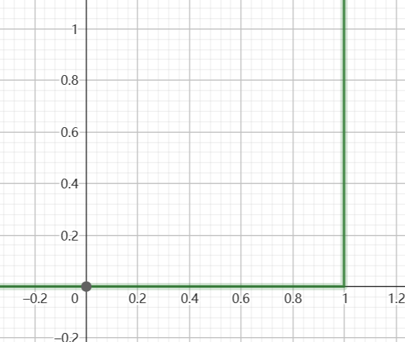

# 积分的全局行为（二）——积分估计

## 单点突起类积分极限处理

设有$f(x)\in\Re[a,b]$，$\varphi_n(x)$满足“单点突起”，即有
$$
\begin{align}
&\varphi(x)\rightarrow+\infty,x\rightarrow x_{\star}\\
&\forall\epsilon>0,\exists\delta>0,\forall x\in[a,x_{\star}-\delta)\cup(x_{\star}+\delta,b],\varphi(x)<\epsilon.
\end{align}
$$
下面我们给出这种函数的一个示意图，这是$\varphi_n(x)=10^6x^{10^6}$的图象。

我们想要求
$$
\lim_{n\rightarrow+\infty}\int_a^bf(x)\varphi_n(x)\text{d}x.
$$
我们可以考虑分三段处理：$[a,x_{\star}-\delta),[x_{\star}-\delta,x_{\star}+\delta],(x_{\star}+\delta,b].$
$$
\int_a^{x_\star-\delta}f(x)\varphi_n(x)\text{d}x<\sup_{[a,b]}f(x)\epsilon\int_a^{x_{\star}-\delta}\text{d}x<\sup_{[a,b]}f(x)x_{\star}\epsilon\rightarrow0.
$$
区间$(x_{\star}+\delta,b]$同理。

下面处理区间$[x_{\star}-\delta,x_{\star}+\delta].$

根据积分第一中值定理，有
$$
\int_{x_{\star}-\delta}^{x_{\star}+\delta}f(x)\varphi_n(x)=f(x_\delta)\int_{x_{\star}-\delta}^{x_{\star}+\delta}\varphi_n(x)\text{d}x.
$$
一般题目的设定会使右边的积分项为常数$C$，而左边$f(x_{\delta})\rightarrow f(x_\star)$，故有
$$
\int_{x_{\star}-\delta}^{x_{\star}+\delta}f(x)\varphi_n(x)=Cf(x_\star).
$$
综上，有
$$
\int_a^bf(x)\varphi_n(x)=Cf(x_\star).
$$
:::: example

已知$f\in C[0,1]$，求
$$
\lim_{n\rightarrow+\infty}(n\int_0^1e^{-nx}f(x)\text{d}x).
$$
::: info 解
$$
g_n(x)=ne^{-nx}
$$
易知$g(x)$在$x=0$处单点突起。根据上面推导的结论，只需计算
$$
\int_0^{\delta}ne^{-nx}\text{d}x.
$$
显见$\int_0^{\delta}ne^{-nx}\text{d}x=e^{-nx}|_{0}^{\delta}\rightarrow 1$.

则有
$$
\lim_{n\rightarrow+\infty}(n\int_0^1e^{-nx}f(x)\text{d}x)=f(0).
$$
:::

::::

思考题

::: example

已知$f\in C[0,1]$，求
$$
\lim_{n\rightarrow+\infty}(\sqrt{n}\int_0^1f(x)\sin^{2n}(2\pi x)\text{d}x).
$$
:::

::: details

笔者没做出来，所以不用找了，这里没答案。

靠你了！！！

下面是我的部分思路，仅供参考。
$$
g(x)=\sqrt{n}\sin^{2n}(2\pi x).
$$
通过求导，易见其为单点突出函数，此点为$x=\frac{1}{4}.$

根据上面的结论，只需求
$$
\int_{1/4-\delta}^{1/4+\delta}\sqrt{n}\sin^{2n}(2\pi x)\text{d}x.
$$
进一步化简，只需求
$$
\sqrt{n}\int_{-\delta}^{+\delta}\cos^{2n}t\text{d}t.
$$
这个积分的原函数是可求的，但不够优雅；更优雅的做法应该是展开。
$$
\begin{align}
&=\sqrt{n}\int_{-\delta}^{+\delta}[1+\sum_{i=1}^{n}\frac{(-1)^i}{(2i)!}t^i+o(t^n)]^{2n}\\
&=2\sqrt{n}\int_{0}^{+\delta}[1+2n\sum_{i=1}^{n}\frac{(-1)^i}{(2i)!}t^i]\\
&=2\sqrt{n}[t+2n\sum_{i=1}^{n}\frac{(-1)^i}{(2i+1)!}t^{2i+1}]|_{t=0}^\delta
\end{align}
$$
因此，为消去$\sqrt{n}$，应取$\delta_n=\frac{1}{\sqrt{n}}.$
$$
=2+o(1).
$$
但这种做法的问题在于，为什么分子是1而不是其他呢？如果取其他分子，仍然能得到常数，但结果不同。所以取$\delta_n$这一步完完全全是错误的。

然后我就不会了。

等我想到我再来填坑。

:::