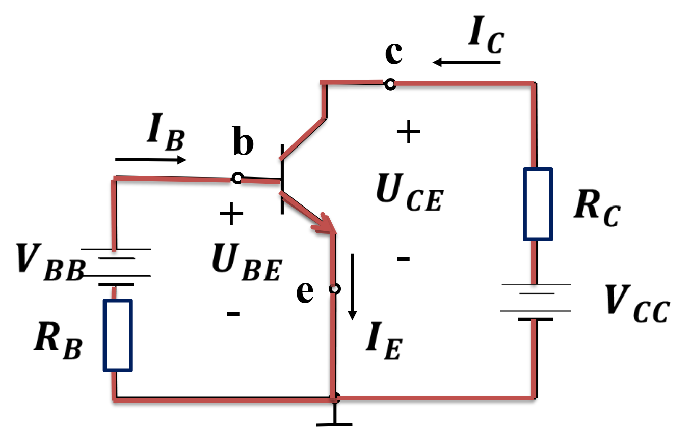

# 1.3晶体三极管

英文简称 `BJT` ，用字母 `T` 表示。

## 分类

**材料** ：硅管，锗管

**结构** ：NPN，PNP

**使用频率** ：低频管，高频管

**功率** ：小功率管（<500mW），中功率管（0.5~1W），大功率管（>1W）

## 结构

以 **NPN型** 为例

上层的N区为发射区，掺杂浓度高；

中间的P区称为基区，很薄且掺杂浓度低；

下层的N区为集电区，面积很大；

他们所引出的三个电极分别为发射极e，基极b，集电极c。

两种三极管的符号分别为

## 原理

### 三种组态

**共发射极（CE）**

$V_{BB}$为输入电压信号，接入基极-发射极回路，称为输入回路；放大后的信号在集电极-发射极回路，称为输出回路，e点（发射极）为公共端，故也称作 **共射放大电路** 。

**共集电极（CC）**

**共基极（CB）**

### 晶体管的放大条件

内部条件：

- 发射区掺杂浓度最高：便于发射载流子
- 基区薄且掺杂浓度低
- 集电区掺杂浓度较高
- 集电结面积大：便于收集载流子

外部条件

- 发射结正偏
- 集电结反偏

由以上条件可知，输入回路需加基极电源$V_{BB}$，输出回路需加集电极电源$V_{CC}$且$V_{CC}>V_{BB}$

### 晶体管内部载流子的运动

在$V_{BB}$作用下，发射结正偏，电子由发射区向基区移动形成电流$I_{EN}$，空穴反之形成电流$I_{BP}$（极微弱）。以发射区向基区注入多子的过程为主。
$$
I_E=I_{EN}+I_{BP} \approx I_{EN}
$$
由于基极很薄，所以只有极少数电子与空穴复合，形成电流$I_{BN}$是形成基极电流的主体。

剩余的多数电子未被复合，向集电结扩散并到达集电极形成电流$I_{CN}$，是形成集电极电流$I_C$的主体。

由于集电结反偏，少数载流子会由于电场作用产生漂移，形成漂移电流$I_{CBO}$（常忽略）。

基区空穴由$I_B$和$I_{CBO}$形成。
$$
I_B=I_{BN}+I_{BP}-I_{CBO} \approx I_{BN} - I_{CBO} \approx I_{BN}
$$

### 电流分配关系

$$
I_{CN}=I_C-I_{CBO} \\
I_{BN}=I_B+I_{CBO} \\
I_E=I_{EN}+I_{BP} \approx I_{EN}
$$

有如下关系
$$
\bar \beta = {I_{CN} \over I_{BN}}={I_C-I_{CBO} \over I_B+I_{CBO}} \\
I_C=\bar \beta I_B+(1+\bar \beta)I_{CBO}=\bar \beta I_B+I_{CEO}
$$

其中，$\bar \beta$为共射直流放大系数，$I_{CEO}$为穿透电流。

> [!note]
>
> 常温下，$(1+\bar \beta)I_{CBO}$和$I_{CEO}$数值很小，可以忽略不计。但它们对温度敏感。

忽略以上次要因素有
$$
I_E=I_C+I_B \\
I_C=\bar \beta I_B \\
I_E=(1+\bar \beta)I_B
$$
数值上$I_C$接近$I_E$且远大于$I_E$。

> [!note]
>
> $I_B$控制闸门开度，即$I_C$受$I_B$控制：$I_C=\beta I_B$ 
