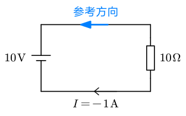

# 电流、电压、电功率

## 电流

- 定义：电荷 $q$ 的定向运动
- 大小：$\displaystyle i(t)\triangleq\lim_{\Delta t\to 0}{\Delta q\over\Delta t}={\mathrm dq\over\mathrm dt}$[^1]
- 方向：正电荷的运动方向

### 参考方向

但在实际电路问题中，为分析方便，我们会人**为假定一个方向作为电流的参考方向**。

- 当参考方向与真实方向一致时，电流取正；
- 当参考方向与真实方向相反时，电流取负。

::: details 参考方向的例子

例如，在这样一张图中：

假设为了研究方便设置了如蓝色箭头所示的参考方向，计算结果是 $I=-1\operatorname {A}$，则说明实际电流方向与参考方向相反。

---

又例如在交流电路中：

当电流在正半轴时，电流与参考方向相同；在负半轴时相反。

:::

### 分类

- 直流 $I$：大小和方向不随时间变化的电流（缩写 DC）
- 交流 $i$：随时间周期性变化且平均值为零的电流（缩写 AC）
- 任意电流 $i(t)$

## 电压

- 定义：电场强度对距离的积分，$\displaystyle u_{ab}=\int_a^bE_c\mathrm dl$
- 方向：规定为**电位降低的方向**

### 电位

电势的别称。

- 系统中选取任意一点为参考点，参考点的电位为 0；
- 电路中某点到参考点之间的电压称为该点的电位。

### 关联参考方向与非关联参考方向

电压同样可以选取参考方向，最终结果为正则相同，负则相反。这里就有可能出现电流和电压参考方向相同或不同两种情况。

- $u,i$ 参考方向一致：称为**关联参考方向**
- $u,i$ 参考方向不一致：称为**非关联参考方向**

> [!warning]
>
> 问是否关联参考方向时要注意问的是哪个元件！不同元件情况可能不同。

## 电功率

$$
P={\mathrm dW\over\mathrm dt}={u\mathrm dq\over \mathrm dt}=ui
$$

### 功率的吸收和发出

- 「吸收功率」：消耗电能，$U,I$ **实际方向相同**（电流顺电场流动）
- 「发出功率」：发出电能。$U,I$ **实际方向相反**（电流逆电场流动）

### 参考方向与功率

列功率时统一按照「吸收功率」来列：

- 对于关联参考方向：$P=ui$
- 对于非关联参考方向：$P=-ui$

这样算出来功率大于零即代表实际吸收，小于零即实际发出。

这样的处理，使得我们不必提前预知电压或电流的方向，也不用关心吸收还是放出功率，可以直接规定参考方向，这样算出来什么就是什么。

::: example

求元件 A 和 B 的功率。

---

A 为关联参考方向，因此有 $P_A=ui=-5\operatorname W$，故 A 发出功率 $5\operatorname W$。

B 为非关联参考方向，因此有 $P_B=-u_Bi_B=-5\operatorname {MW}$，故 B 发出功率 $5\operatorname {MW}$。

:::

### 端口的功率

端口：流入流出电流相等的一对端子。

判断是否为关联参考方向时，将**画给我们的那部分视为整体来判断**（称为**向内关联**）

[^1]: 符号 $\triangleq$ 表示「将……定义为……」。