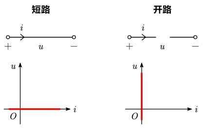
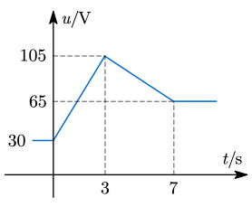

# 电路元件

## 基本理想电路元件

- 电阻元件：消耗电能的元件
- 电感元件：产生磁场，储存磁场能量的元件
- 电容元件：产生电场，储存电场能量的元件
- 电压源和电流源：将其它形式的能量转变成电能的元件

## 电阻元件

### 电阻

- 符号：$R$
- 公式：$R\triangleq\dfrac UI$
- 单位：欧姆 $\operatorname \Omega$
- 耗能元件，吸收功率

### 短路与开路

- 短路：当 $R=0$（$G=\infty$）时，$u=0$，$i$ 由外电路决定[^1]
- 开路：当 $R=\infty$（$G=0$）时，$i=0$，$u$ 由外电路决定

## 电容元件[^2]

### 电容

- 符号：$C$
- 定义：$C\triangleq\dfrac qU$
- 单位：法拉 $\operatorname F$
- 电容器：两块相互靠近的金属板，中间夹着一层绝缘介质，能够储存电荷和电能。

### 电容器

- 一般电容：

- 可调电容：

- 电解电容：

根据前面的定义式可以推出：

$$
\mathrm du(t)=\frac1C\mathrm dq(t)=\frac1Ci(t)\mathrm dt\tag{1}
$$

可以得到==电容电压的计算公式：$\displaystyle u(t)=u(t_0)+\frac1C\int_{t_0}^ti(t)\mathrm dt$==

由 $(1)$ 继续推导，若 $C$ 上 $u,i$ 为关联参考方向，设 $W_C$ 为电容器上储存的电能，则有

$$
p=u(t)\cdot i(t)=u\cdot{C\mathrm du\over \mathrm dt}={\mathrm d\over\mathrm dt}\frac12Cu^2={\mathrm d\over\mathrm dt}W_C
$$

得==电容的电能计算公式：$W_C=\dfrac12Cu^2$==。因此：

- 若 $|u|\uparrow$，$|W_C|\uparrow$，$P>0$，$C$ 吸收功率
- 若 $|u|\downarrow$，$|W_C|\downarrow$，$P<0$，$C$ 发出功率

因此，$C$ 为储能、无源元件，且不耗能。

::: example

已知 $C=0.2\operatorname {F}$，$u(0)=30\operatorname V$，电容电流波形已知，求电容电压并画出波形。

---

1. $0\le t<3s$，$i=5\operatorname A>0$，电容充电

   $$
   \begin{align}
   u&=u(0)+\frac1C\int_0^ti(\xi)\mathrm d\xi\\
   &=30+\frac1{0.2}\int_0^t\mathrm 5d\xi=30+25t\operatorname {(V)}
   \end{align}
   $$

   且有 $u(3\mathrm s)=(30+25\times3)\operatorname V=105\operatorname V$。

2. $3\operatorname s\le t<7\operatorname s$，$i=-2\operatorname A<0$，电容放电

   $$
   \begin{align}
   u&=u(3\mathrm s)+\frac1C\int_3^ti(\xi)\mathrm d\xi\\
   &=105+\frac1{0.2}\int_3^t(-2)\mathrm d\xi=135-10t\operatorname {(V)}
   \end{align}
   $$

   且有 $u(7\mathrm s)=65\operatorname V$。

3. $t\ge7\operatorname s$，$i=0$，电容电压保持不变，$u(t)=u(7\mathrm s)=65\operatorname V$。

据此画出电压波形：

:::

## 电感元件

### 电感

- 符号：$L$
- 单位：亨利 $\operatorname H$

[^1]: $G$ 是电导的符号。电导定义为电阻的倒数。

[^2]: 自第 5 版起，电容与电感元件的介绍移动到第 6 章。本套笔记所参考的视频课使用的是第 4 版教材，且笔者认为有必要在开头介绍一下电容与电感元件，因此将这部分保留在第一章。
