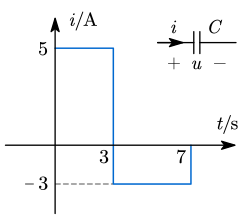
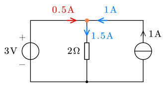

# 电路元件

## 基本理想电路元件

- 电阻元件：消耗电能的元件
- 电感元件：产生磁场，储存磁场能量的元件
- 电容元件：产生电场，储存电场能量的元件
- 电压源和电流源：将其它形式的能量转变成电能的元件

## 电阻元件

### 电阻

- 符号：$R$
- 公式：$R\triangleq\dfrac UI$
- 单位：欧姆 $\operatorname \Omega$
- 耗能元件，吸收功率

### 短路与开路

- 短路：当 $R=0$（$G=\infty$）时，$u=0$，$i$ 由外电路决定[^1]
- 开路：当 $R=\infty$（$G=0$）时，$i=0$，$u$ 由外电路决定

## 电容元件

> 自第 5 版起，电容与电感元件的介绍移动到第 6 章。本套笔记所参考的视频课使用的是第 4 版教材，且笔者认为有必要在开头介绍一下电容与电感元件，因此将这部分保留在第一章。

### 电容

- 符号：$C$
- 定义：$C\triangleq\dfrac qU$
- 单位：法拉 $\operatorname F$
- 电容器：两块相互靠近的金属板，中间夹着一层绝缘介质，能够储存电荷和电能。

### 电容器

- 一般电容：

- 可调电容：

- 电解电容：

根据前面的定义式可以推出：

$$
\mathrm du(t)=\frac1C\mathrm dq(t)=\frac1Ci(t)\mathrm dt\tag{1}
$$

可以得到==电容电压的计算公式：$\displaystyle u(t)=u(t_0)+\frac1C\int_{t_0}^ti(t)\mathrm dt$==

由 $(1)$ 继续推导，若 $C$ 上 $u,i$ 为关联参考方向，设 $W_C$ 为电容器上储存的电能，则有

$$
p=u(t)\cdot i(t)=u\cdot{C\mathrm du\over \mathrm dt}={\mathrm d\over\mathrm dt}\frac12Cu^2={\mathrm d\over\mathrm dt}W_C
$$

得==电容的电能计算公式：$W_C=\dfrac12Cu^2$==。因此：

- 若 $|u|\uparrow$，$|W_C|\uparrow$，$P>0$，$C$ 吸收功率（储能）
- 若 $|u|\downarrow$，$|W_C|\downarrow$，$P<0$，$C$ 发出功率（放能）

因此，$C$ 为储能、无源元件，且不耗能。

::: example

已知 $C=0.2\operatorname {F}$，$u(0)=30\operatorname V$，电容电流波形已知，求电容电压并画出波形。

---

1. $0\le t<3s$，$i=5\operatorname A>0$，电容充电

   $$
   \begin{align}
   u&=u(0)+\frac1C\int_0^ti(\xi)\mathrm d\xi\\
   &=30+\frac1{0.2}\int_0^t\mathrm 5d\xi=30+25t\operatorname {(V)}
   \end{align}
   $$

   且有 $u(3\mathrm s)=(30+25\times3)\operatorname V=105\operatorname V$。

2. $3\operatorname s\le t<7\operatorname s$，$i=-2\operatorname A<0$，电容放电

   $$
   \begin{align}
   u&=u(3\mathrm s)+\frac1C\int_3^ti(\xi)\mathrm d\xi\\
   &=105+\frac1{0.2}\int_3^t(-2)\mathrm d\xi=135-10t\operatorname {(V)}
   \end{align}
   $$

   且有 $u(7\mathrm s)=65\operatorname V$。

3. $t\ge7\operatorname s$，$i=0$，电容电压保持不变，$u(t)=u(7\mathrm s)=65\operatorname V$。

据此画出电压波形：

:::

## 电感元件

### 电感

- 符号：$L$
- 单位：亨利 $\operatorname H$
- 定义：$E_L=-L\dfrac{\mathrm di}{\mathrm dt}$，其中 $E_L$ 为感应出的电动势。

### 电感器

变化的电流感应出磁场。磁链（即磁通量）$\psi$ 与电流 $i$ 存在代数关系。如果线圈的磁场存在于线性介质，==磁链与电流成正比 $\psi=Li$==。

若 $L$ 上 $u,i$ 为关联参考方向，则根据电感的定义有

$$
p=ui=Li{\mathrm di\over\mathrm dt}={\mathrm d\over\mathrm dt}\frac12Li^2=\frac{\mathrm dW_L}{\mathrm dt}
$$

故有==电感的电能计算公式：$\displaystyle W_L=\frac12Li^2={\psi^2\over 2L}$==。因此：

- 若 $|i|\uparrow$，$|W_L|\uparrow$，$P>0$，$L$ 吸收功率（储能）
- 若 $|i|\downarrow$，$|W_L|\downarrow$，$P<0$，$L$ 发出功率（放能）

因此电感为储能元件、无源元件，且不耗能。

> [!note]
>
> 电容与电感是相对应的，电容对电压敏感，电感对电流敏感。因此电容与电感的公式也是对偶的。

## 独立源

### 独立电压源

- 输出电压 $u(t)$ 与电流 $i(t)$ 无关
- 电压源不得短路
- $U_s=0$ 时，电压源不作用——相当于所在支路短路

**电压源不允许直接并联**。下面的电路是**不允许的**：

但是电压源可以串联，最终电压相加。

### 独立电流源

- 输出电流 $i(t)$ 与电压 $u(t)$ 无关
- 电流源不得开路
- $I_s=0$ 时，电流源不作用——相当于所在支路开路

**电流源不允许直接串联**，下面的电路是**不允许的**：

但是电流源可以并联，最终电流相加。

::: example

求电压源、电流源吸收的功率分别为？

---

先不要慌，从高中知识入手。

电阻两端的电压是 $3\operatorname V$，电阻为 $2\operatorname \Omega$，则其电流为 $I_R=\dfrac uR=1.5\operatorname A$。

取上方中间的节点，流入电流等于流出电流，可推出电压源的电流为 $0.5\operatorname A$。

电压源为上正下负，电压参考方向是向下，而这里我们电流的参考方向向上，为非关联参考方向，因此有
$$
P_V=-ui=-3\times0.5=-1.5\operatorname W
$$
即电压源给出 $1.5\operatorname W$ 功率。

再来看电流源，此处电流源两端电压明显为 $3\operatorname V$，参考方向是向下，与电流参考方向相反，为非关联参考方向，因此有
$$
P_A=-ui=-3\times1=-3\operatorname W
$$
即电流源给出 $3\operatorname W$ 功率。

综上，电压源吸收 $-1.5\operatorname W$，电流源吸收 $-3\operatorname W$。

:::

## 受控源

- 受控电源：源电压或源电流受电路中另一处电压或电流控制。
- 线性受控源：受控量与控制量成正比，控制系数为常量。
- 受控源的分类：
  - 电压控制电压源 VCVS（Voltage-Controlled Voltage Source）
  - 电流控制电压源 CCVS（Current-Controlled Voltage Source）
  - 电压控制电流源 VCCS（Voltage-Controlled Current Source）
  - 电流控制电流源 CCCS（Current-Controlled Current Source）

至于如何受控，需要具体问题具体分析。

::: example

求两个受控源各自发出的功率。

---

考虑节点 (2)，流入 $9\operatorname A$ 电流，流出 $i_1+2i_1=3i_1$，故有 $i_1=3\operatorname A$。

考虑电阻，有 $u_1=i_1R=6\operatorname V$。

考虑受控电压源，为非关联参考方向，故有 $P_V=-2i_1\cdot3u_1=-108\operatorname W$。

考虑受控电流源。两个受控源电压之和为电阻电压 $u_1$，故有 $u_A=u_1-3u_1=-2u_1$ 方向向下。此时受控电流源为关联参考方向，有 $P_A=-2u_1\cdot2i_1=-72\operatorname W$。

综上，受控电压源发出功率 $108\operatorname W$，受控电流源发出功率 $72\operatorname W$。

:::

[^1]: $G$ 是电导的符号。电导定义为电阻的倒数。
