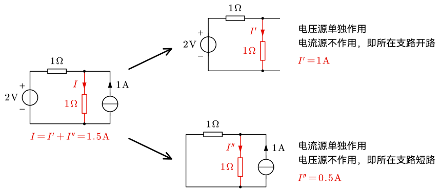
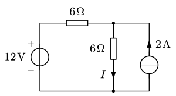

# 3.1 电路定理

## 置换定理

置换定理：若一端囗 N（或支路 k）的电压为 $U$ 或电流为 $I$，则**可用 $U_S=U$ 或 $I_S=I$ 的独立源来置换**一端囗 N（支路 k），置换后剩余电路的电压电流保持不变。

::: example

用置换定理求解图中的 $I_1$ 和 $R$。

---

将 $R$ 所在的支路替换为电流源。注意到电流源与电阻并联，可以等效为一个独立电压源：

因此有 $I_1=\dfrac{26-10}{4}=4\operatorname A$。

回到原图中，$U_2=(4-2)\times5=10\operatorname V$。则有 $R=\dfrac{10}2=5\,\ohm$。

:::

- 置换定理适用于**线性、非线性电路、定常和时变电路**；
- 应用置换定理必须**满足唯一解**；
- **被置换的支路和电路其他部分应该无耦合关系**；
- 推论：若电路中某两点间**电压为 0**，便可将这两点**短路**（用 $U_S = 0$ 的电压源置换）；若某支路**电流为 0**，便可将此支路开路（用 $I_S = 0$ 的电流源置换）。

## 叠加定理

**叠加定理**：在==线性电路==中，几个独立电源共同作用产生的响应等于各独立电源单独作用时产生响应的代数和。

> [!warning]
>
> 叠加定理只能用于**线性电路**！这一点非常重要，甚至可能考在概念题中。

::: example

求图中的电流 $I$。

---

利用叠加定理求解。

假设电压源不作用，令其支路短路，则电流源的 $2\operatorname A$ 均分给两个电阻的支路，则 $I'=1\operatorname A$。

假设电流源不作用，令其支路开路，则两个电阻串联，$I''=\dfrac{12}{6+6}=1\operatorname A$。

因此 $I=I'+I''=2\operatorname A$。

:::

## 齐性定理

**齐性定理**：线性直流电路的响应 ($U$ 或 $I$) 是**各独立源 $U_S$、$I_S$ 的一次齐性函数**，若只有一个独立源，则响应与激励成正比。

$$
\begin{align}
U&=\sum a_kU_{SK}+\sum r_kI_{SK}\\
I&=\sum g_kU_{SK}+\sum\beta_kI_{SK}
\end{align}
$$

了解即可。
