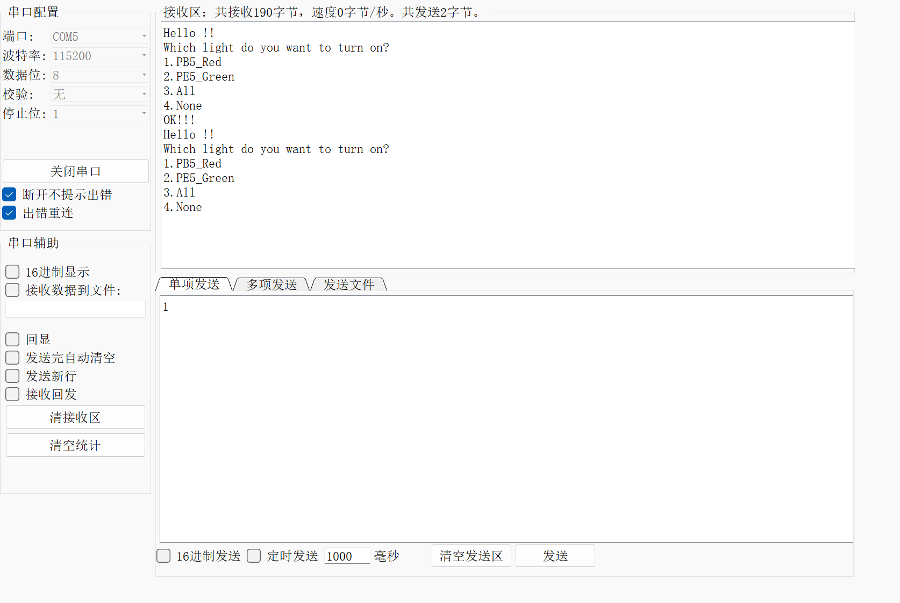
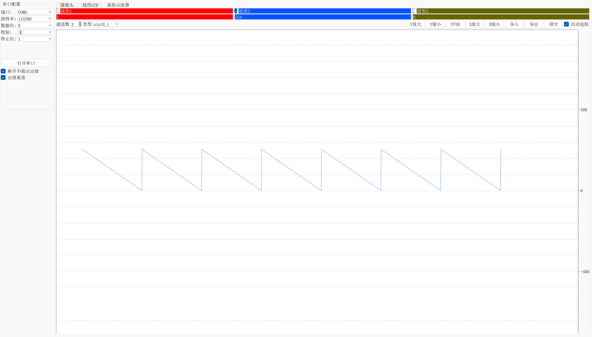
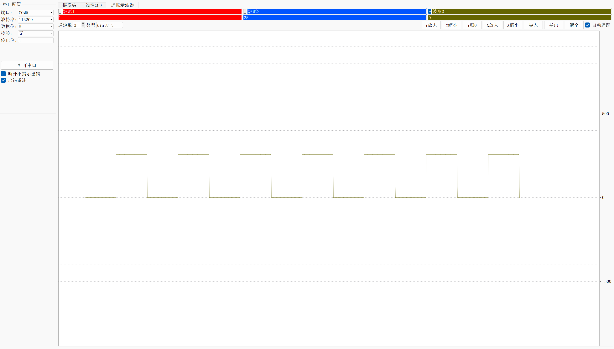
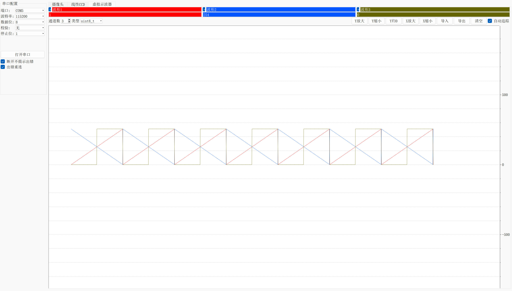

# 第二讲作业

## 一、按键改变LED模式

### 要求

基于外部中断（EXTI）的内容，实现功能：通过按键改变LED的闪烁频率，要求有三 档以上的模式切换。 例如：默认情况，LED常亮，按键按下一次后，LED以1Hz频率闪烁，按键再按下一次 后，LED以5Hz频率闪烁，按键再按下一次后，LED以10Hz频率闪烁，按键再按下一次后， LED常亮，以此循环切换模式。

### Code

新增变量 `flag` 用于累加按键次数，判断模式

```C
/* Private variables ---------------------------------------------------------*/

/* USER CODE BEGIN PV */

int flag=0;

/* USER CODE END PV */
```

`main()` 中

```C
/* USER CODE BEGIN WHILE */
  while (1)
  {
		if(flag%4==0 && HAL_GPIO_ReadPin(GPIOB,GPIO_PIN_5) == GPIO_PIN_SET) { //模式一（初始状态） 并且灯灭
			HAL_GPIO_WritePin(GPIOB,GPIO_PIN_5,GPIO_PIN_RESET);//亮灯
		}else if(flag%4==1){ //模式二 1Hz闪烁
			HAL_GPIO_TogglePin(GPIOB,GPIO_PIN_5);//反转电平 下同
			HAL_Delay(1000);
		}else if(flag%4==2) {//模式三 5Hz闪烁
			HAL_GPIO_TogglePin(GPIOB,GPIO_PIN_5);
			HAL_Delay(200);
		}else if(flag%4==3) {//模式四 10Hz闪烁
			HAL_GPIO_TogglePin(GPIOB,GPIO_PIN_5);
			HAL_Delay(100);
		}
    /* USER CODE END WHILE */
      
    /* USER CODE BEGIN 3 */
  }
  /* USER CODE END 3 */
```

`HAL_GPIO_EXTI_Callback(）` EXTI中断回调函数

```C
void HAL_GPIO_EXTI_Callback(uint16_t GPIO_Pin){
	flag++;//累计按键次数
}
```


### 实现

查阅视频

## 二、函数重定向交互

### 要求

重定向 `scanf();` 和 `printf();` 并通过串口进行 输入、输出 和 亮灯 实验。

### Code

引入头文件

```C
/* USER CODE BEGIN Includes */

# include "stdio.h"

/* USER CODE END Includes */
```

新增变量

```C
uint8_t RxData;
```

查看定义，重定向 `printf();` 和 `scanf();` 。

```C
int fputc(int ch, FILE *f) {//printf()
	HAL_UART_Transmit(&huart1, (uint8_t *)&ch, 1, 0xffff);
	return ch;
}

int fgetc(FILE *f) {//scanf()
	uint8_t ch=0;
	HAL_UART_Receive(&huart1, &ch, 1, 0xffff);
	return ch;
}
```

`main()` 函数中的实现

```C
while (1)
  {
//		HAL_UART_Receive_IT(&huart1,(uint8_t *)RxData,1);
		printf("Hello !!\r\n");
		HAL_Delay(10);
		printf("Which light do you want to turn on? \r\n");
		printf("1.PB5_Red \r\n");
		printf("2.PE5_Green \r\n");
		printf("3.All \r\n");
		printf("4.None \r\n");
		scanf("%c",&RxData);
		switch(RxData) {
			case '1'://接收到1时
				HAL_GPIO_WritePin(GPIOE, GPIO_PIN_5, GPIO_PIN_SET);//绿灯灭
				HAL_GPIO_WritePin(GPIOB, GPIO_PIN_5, GPIO_PIN_RESET);//红灯亮
				printf("OK!!! \r\n");
				break;
			case '2'://接收到2时
				HAL_GPIO_WritePin(GPIOB, GPIO_PIN_5, GPIO_PIN_SET);//绿灯亮
				HAL_GPIO_WritePin(GPIOE, GPIO_PIN_5, GPIO_PIN_RESET);//红灯灭
				printf("OK!!! \r\n");
				break;
			case '3': //接收到3时 全亮
				HAL_GPIO_WritePin(GPIOB, GPIO_PIN_5, GPIO_PIN_RESET);
				HAL_GPIO_WritePin(GPIOE, GPIO_PIN_5, GPIO_PIN_RESET);
				printf("OK!!! \r\n");
				break;
			case '4': //接收到4时 全灭
				HAL_GPIO_WritePin(GPIOB, GPIO_PIN_5, GPIO_PIN_SET);
				HAL_GPIO_WritePin(GPIOE, GPIO_PIN_5, GPIO_PIN_SET);
				printf("OK!!! \r\n");
				break;
		}
    /* USER CODE END WHILE */

    /* USER CODE BEGIN 3 */
  }
  /* USER CODE END 3 */
```


### 实现

输入输出



## 三、虚拟示波器

### 要求

查阅 山外调试助手手册 实现虚拟示波器

### Code

新增变量

```C
/* Private variables ---------------------------------------------------------*/

/* USER CODE BEGIN PV */
uint8_t wave_head[2]={0x03,0xFC};//协议头
uint8_t wave_end[2]={0xFC,0x03};//协议尾
uint8_t a=0, b=255;//三角波初始
uint8_t high=255,low=1;//方波高低
uint8_t TxData[3];//数据
/* USER CODE END PV */
```

`main()` 中

```C
  /* USER CODE BEGIN WHILE */
  while (1)
  {
    /* USER CODE END WHILE */

    /* USER CODE BEGIN 3 */
		
      	 //发送协议头
		HAL_UART_Transmit(&huart1, wave_head, 2, 1000);
		//生成波型数据
		//triangle
		a++;b--;
		if(a>=255) a=0;
		if(b<=0) b=255;
		TxData[0]=a;
		TxData[1]=b;
		TxData[2]=0;
      
      	 //square
		if(a>=127) 
		TxData[2]=255;
		else if(a<127) 
		TxData[2]=0;
      
      	 //发送波形数据
		HAL_UART_Transmit(&huart1, TxData, 3, 1000);
      
      	//发送协议尾
		HAL_UART_Transmit(&huart1, wave_end, 2, 1000);
		HAL_Delay(50);
  }
  /* USER CODE END 3 */
```


### 实现

三角波1


三角波2



矩形波



三合一图像

