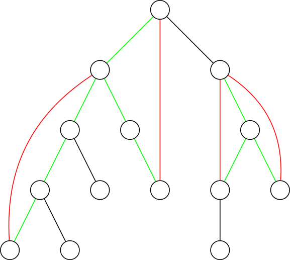
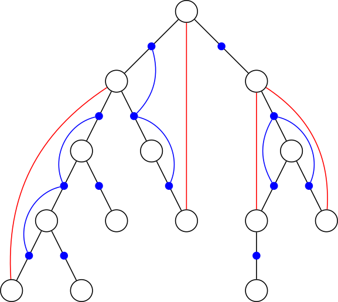

# 双连通分量 学习笔记

## 简介

在阅读下列内容之前，请务必了解 [图论相关概念](./图论基础 学习笔记.md) 部分。

相关阅读：[割点和桥](./割点与桥 学习笔记.md)

## 定义

在一张连通的无向图中，对于两个点 $u$ 和 $v$，如果无论删去哪条边（只能删去一条）都不能使它们不连通，我们就说 $u$ 和 $v$  **边双连通**。

在一张连通的无向图中，对于两个点 $u$ 和 $v$，如果无论删去哪个点（只能删去一个，且不能删 $u$ 和 $v$ 自己）都不能使它们不连通，我们就说 $u$ 和 $v$  **点双连通**。

边双连通具有传递性，即，若 $x,y$ 边双连通，$y,z$ 边双连通，则 $x,z$ 边双连通。

点双连通 **不** 具有传递性，反例如下图，$A,B$ 点双连通，$B,C$ 点双连通，而 $A,C$  **不** 点双连通。


对于一个无向图中的 **极大** 边双连通的子图，我们称这个子图为一个 **边双连通分量**。

对于一个无向图中的 **极大** 点双连通的子图，我们称这个子图为一个 **点双连通分量**。

**e-DCC性质** ：边双连通分量中**任意一条边**都**包含在至少一个简单环**中

- 这条性质也是边双的**充要**条件

## DFS 生成树

对于一张连通的无向图，我们可以从任意一点开始 DFS，得到原图的一棵 DFS 生成树（以开始 DFS 的那个点为根），这棵生成树上的边称作 **树边**，不在生成树上的边称作 **非树边**。

由于 DFS 的性质，我们可以保证所有非树边连接的两个点在生成树上都满足其中一个是另一个的祖先。

## 边双连通分量

### 例题

[洛谷 P8436【模版】边双连通分量](https://www.luogu.com.cn/problem/P8436)

题意：对于一个 $n$ 个节点 $m$ 条无向边的图，请输出其边双连通分量的个数，并且输出每个边双连通分量。

### Tarjan 算法 1

用 Tarjan 求双连通分量过程与求强连通分量类似，可以先阅读 强连通分量 的 Tarjan 算法。

我们考虑先求出所有的桥，再 DFS 求出边双连通分量。

求桥可参见 割点和桥 的桥部分。

时间复杂度 $O(n+m)$。

### Tarjan 算法 2

我们先总结出一个重要的性质：

- 在无向图中，DFS 生成树上的边不是树边就只有非树边。

我们联系一下求强连通分量的方法，在无向图中只要一个分量没有桥，那么在 DFS 生成树上，它的所有点都在同一个强连通分量中。

反过来，在 DFS 生成树上的一个强连通分量，在原无向图中是边双连通分量。

可以发现，求边双连通分量的过程实际上就是求强连通分量的过程。

时间复杂度 $O(n+m)$。

### 差分算法

和 Tarjan 算法 1 类似，我们先求出所有的桥，再差分求出边双连通分量。

首先，对原图进行 DFS。



如上图所示，黑色与绿色边为树边，红色边为非树边。每一条非树边的两个端点都唯一对应了树上的一条由树边构成的简单路径，我们说这条非树边 **覆盖** 了这条简单路径上所有的边。

在图中，绿色的树边 **至少** 被一条非树边覆盖，黑色的树边不被 **任何** 非树边覆盖。

显然，**非树边** 和 **绿色的树边** 一定不是桥，**黑色的树边** 一定是桥。

首先考虑一个暴力的做法，对于每一条非树边，都逐个地将它覆盖的每一条树边置成绿色，时间复杂度为 $O(nm)$。

考虑用差分优化。对于每一条非树边，在其树上深度较小的端点处打上 `-1` 标记，在其树上深度较大的端点处打上 `+1` 标记，然后 $O(n)$ 求出每个点的子树内部的标记和。

对于一个点 $u$，其子树内部的标记之和等于覆盖了 $u$ 和 $fa_u$ 之间的树边的非树边数量。若这个值等于 $0$，则 $u$ 和 $fa_u$ 之间的树边是 **桥**。

再用 DFS 求出边双连通分量。

时间复杂度 $O(n+m)$。

> [!note]
>
> 这个算法实现起来比起之前的Tarjan算法麻烦，但是他的正确性显然，可以作为Tarjan算法更新low[]数组策略正确性的一个简单的证明路径：
>
> - 树边即是DFS遍历时用于“发现新节点”的边，此时使用下游节点的low[]值更新
> - 或者就是找到了非树边，此时又分三种情况
>   - 找到了子树节点：可知此时更新可有可无（已经被子树回溯更新了）
>   - 找到了祖宗节点：此时由于是无向图，并且能回溯到祖宗，易知这俩一定在同一个DCC内（也就是说，无向图的 eDCC-Tarjan算法 不需要考虑遇到不在栈中的旧节点的情况），于是用祖宗的dfn[]来更新
>   - 找到了父亲节点：如果没有重边，那么这个回溯使用了与来时一样的路径，是无效的；如果有重边并且这不是第一次发现通往父节点的边，那么这样的路径是有效的，使用父节点的dfn[]来更新

### 练习题

[F. Non-academic Problem](https://codeforces.com/contest/1986/problem/F)

题意：自己看吧，基本上就是裸的eDCC缩点

#### AC代码

```c++
#include <bits/extc++.h>
#define OOO cout<<">>>>";	//调试标识

using namespace std;
using namespace __gnu_pbds;

mt19937_64 rnd( time( 0 ) );
typedef long long ll;
typedef uint64_t ull;
template <typename T, typename Compare = std::less<T>>
using oset = tree<T, null_type, Compare, rb_tree_tag, tree_order_statistics_node_update>;

const ll INF = 1e18, Mod = 1e9+7;

ll tt = 1;

void solve() {
	ll n, m, tot = 0, sub = 0,sccnt=0;
	cin >> n >> m;
	
	//原图的邻接表 DFS序 low[]数组 是否在栈记号 EDCC归属标记
	vector<ll> e[n + 1], dfn(n + 1), low(n + 1),vis(n+1),id(n+1);
	
	vector<pair<ll, ll>> brg;	//每一个桥的两端点
	
	map<ll,ll> cnt;
	
	ll x, y;
	for (ll i = 1; i <= m; i++) {	//建图
		cin >> x >> y;
		e[x].emplace_back(y);
		e[y].emplace_back(x);
	}
	
	stack<ll> stk;
	function<void(ll,ll)> Tarjan=[&](ll x,ll fa){
		vis[x]=true;
		dfn[x]=low[x]=++tot;
		stk.push(x);
		for(auto it:e[x]){
			if(!dfn[it]){
				Tarjan(it,x);
				low[x]=min(low[x],low[it]);
			}else if(it!=fa&&vis[it])
				low[x]=min(low[x],dfn[it]);
		}
		ll cur;
		if(low[x]==dfn[x]){
			if(x!=1) brg.emplace_back(make_pair(x,fa));
			++sccnt;
			do{
				cur=stk.top();
				stk.pop();
				vis[cur]=false;
				id[cur]=sccnt;
				cnt[sccnt]++;
			}while(cur!=x);
		}
	};
	
	Tarjan(1,1);
	
//	for(auto [x,y]:brg) cout<<'['<<x<<','<<y<<']'<<' ';cout<<endl;
	
	vector<ll> eg[sccnt+1],subt(sccnt+1);
	for(auto [x,y]:brg){
		eg[id[x]].emplace_back(id[y]);
		eg[id[y]].emplace_back(id[x]);
	}
	
	vis=vector<ll>(n+1,0);
	function<void(ll)> DFS=[&](ll x){
		vis[x]=true;
		subt[x]=cnt[x];
		for(auto it:eg[x])
			if(!vis[it]) DFS(it),subt[x]+=subt[it];
	};
	
	if(brg.size()) DFS(id[brg[0].first]);
	
//	for(ll i=1;i<=sccnt;i++) cout<<subt[i]<<' ';cout<<endl;
	
	for(ll i=1;i<=sccnt;i++)
		sub=max(sub,subt[i]*(n-subt[i]));
//	OOO
	cout<<n*(n-1)/2-sub<<endl;
}
	
int main() {
	ios::sync_with_stdio( 0 );
	cin.tie( 0 );
	cout.tie( 0 );

	cin >> tt;	//非多组测试数据时注释掉即可

	while ( tt-- ) {
		solve();
	}

	cout.flush();
	return 0;
}
```

## 点双连通分量

### 例题

[洛谷 P8435【模板】点双连通分量](https://www.luogu.com.cn/problem/P8435)
题意：对于一个 $n$ 个节点 $m$ 条无向边的图，请输出其点双连通分量的个数，并且输出每个点双连通分量。

### Tarjan 算法

需要先学习割点，可以先参见 割点和桥 的割点部分。

先给出两个性质：

1.  两个点双最多只有一个公共点，且一定是割点。
2.  对于一个点双，它在 DFS 搜索树中 dfn 值最小的点一定是割点或者树根。

我们根据第二个性质，分类讨论：

1.  当这个点为割点时，它一定是点双连通分量的根，因为一旦包含它的父节点，他仍然是割点。
2.  当这个点为树根时：
    1.  有两个及以上子树，它是一个割点。
    2.  只有一个子树，它是一个点双连通分量的根。
    3.  它没有子树，视作一个点双。

我们依然考虑使用上面的 $dfn$ 和 $low$ 来求，我们将深搜时遇到的所有边加入到栈里面，当找到一个割点的时候，就将这个割点往下走到的所有边弹出，而这些边所连接的点就是一个点双了。

### vDcc缩点问题

vDCC缩点相较于SCC缩点和eDCC缩点也有所不同，因为涉及到了割点的分裂，所以每个vDCC缩点后是跟割点进行相连

### 差分算法



如上图所示，黑色边为树边，红色边为非树边，每一条非树边的两个端点都唯一对应了树上由树边构成的的一条简单路径。

考虑一张新图，新图中的每一个点对应原图中的每一条树边（在图中用蓝色点表示）。对于原图中的每一条非树边，将这条非树边对应的树上简单路径中的所有边在新图中对应的蓝点连成一个连通块（在图中用蓝色的边体现出来）。

这样，一个点若 **不是** 割点，当且仅当与其相连的所有边在新图中对应的蓝点都 **属于** 同一个连通块。

两个点 **是** 点双连通，当且仅当它们在原图的树上路径中的所有边在新图中对应的蓝点都 **属于** 同一个连通块，即图中的每个蓝点构成的连通块都是一个点双连通分量。

蓝点间的连通关系可以用与求边双连通时用到的差分类似的方法维护，时间复杂度 $O(n+m)$。