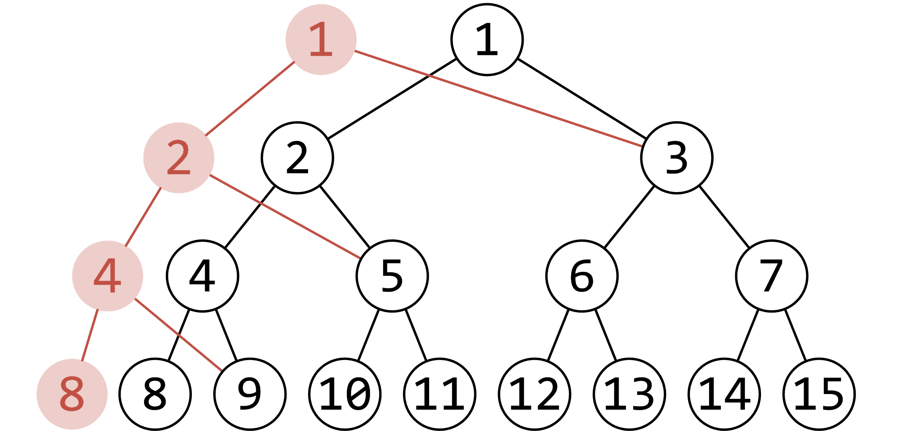

# 可持久化线段树 学习笔记

*很久很久以前，第k小问题突然出现……*

*有这样一棵线段树，它领悟了**动态开点**，经历了**可持久化**，装备上了**权值**，最后得到了**hjt**的赐名，成功升级为了全新版本的线段树——**主席树**。*

#### 前置知识

线段树及其常用操作（区间修改，区间查询，动态开点）、可持久化数据结构

> [!Note]
>
> #### 主席树
>
> 主席树的全称是**可持久化权值线段树**，即主席树真包含于可持久化线段树。

## 可持久化线段树

#### 首先，我们来回顾下线段树：

线段树是一种二叉搜索树，与区间树相似，它将一个区间划分成一些单元区间，每个单元区间对应线段树中的一个叶结点

### 引入

先引入一道 [题目]([P3834 【模板】可持久化线段树 2 - 洛谷 | 计算机科学教育新生态](https://www.luogu.com.cn/problem/P3834))：给定 $n$ 个整数构成的序列 $a$，将对于指定的闭区间 $[l, r]$ 查询其区间内的第 $k$ 小值。

你该如何解决？

一种可行的方案是：使用**主席树**。

主席树的主要思想就是：保存每次插入操作时的**历史版本**，以便查询区间第 $k$ 小。

怎么保存呢？简单暴力一点，每次开一棵线段树呗。  

那空间还不爆掉？

## 解释

我们分析一下，发现每次修改操作修改的点的个数是一样的：

（例如下图，修改了 $[1,8]$ 中对应权值为 1 的结点，红色的点即为更改的点）



只更改了 $O(\log{n})$ 个结点，形成一条链，也就是说每次更改的结点数 = 树的高度。  

注意主席树**不能使用堆式存储法**，就是说不能用 $x\times 2$，$x\times 2+1$ 来表示左右儿子，而是应该**动态开点**，并保存每个节点的左右儿子编号。  

所以我们只要在记录左右儿子的基础上，保存插入每个数的时候的根节点就可以实现持久化了。

#### 子问题：前缀第 k 小

我们把问题简化一下：每次求 $[1,r]$ 区间内的 $k$ 小值。  

怎么做呢？只需要找到插入 r 时的根节点版本，然后用普通权值线段树（有的叫键值线段树/值域线段树）做就行了。

这个相信大家都能理解，回到原问题——

#### 解决：求 $[l,r]$ 区间 $k$ 小值。  

这里我们再联系另外一个知识：**前缀和**。  

这个小东西巧妙运用了区间减法的性质，通过预处理从而达到 $O(1)$ 回答每个询问。

我们可以发现，主席树统计的信息也满足这个性质。  

所以……如果需要得到 $[l,r]$ 的统计信息，只需要用 $[1,r]$ 的信息减去 $[1,l - 1]$ 的信息就行了。

至此，该问题解决！

> [!note]
>
> #### 关于空间问题
>
> 我们分析一下：由于我们是动态开点的，所以一棵线段树只会出现 $2n-1$ 个结点。  
>
> 然后，有 $n$ 次修改，每次至多增加 $\lceil\log_2{n}\rceil+1$ 个结点。因此，最坏情况下 $n$ 次修改后的结点总数会达到 $2n-1+n(\lceil\log_2{n}\rceil+1)$。
>
> 此题的 $n \leq 10^5$，单次修改至多增加 $\lceil\log_2{10^5}\rceil+1 = 18$ 个结点，故 $n$ 次修改后的结点总数为 $2\times 10^5-1+18\times 10^5$，忽略掉 $-1$，大概就是 $20\times 10^5$。
>
> 最后给一个忠告：**千万不要吝啬空间**（大多数题目中空间限制都较为宽松，因此一般不用担心空间超限的问题）！大胆一点，直接上个 $2^5\times 10^5$，接近原空间的两倍（即 `n << 5`）。

### 代码实现

```cpp
#include<iostream>
#include<map>
#include<set>
#include<ctime>
#include<cmath>
#include<queue>
#include<vector>
#include<random>
#include<string>
#include<algorithm>

using namespace std;

mt19937_64 rnd( time( 0 ) );

typedef long long ll;
typedef uint64_t ull;

const ll INF = 1e10,
         Mod = 1e9+7;

ll cnt = 0;
ll n, m;
ll a[600010];
ll root[200010];

struct Node {
	ll lson, rson, cnt;
	Node() {}
} tr[7000010];

void add_node(ll &x, ll pre, ll l, ll r, ll key) {	//重点：和一般的权值线段树的建点不一样
													//需要做原来部分子节点的继承
	if (!x) x = ++cnt;

	tr[x].cnt = tr[pre].cnt + 1;	//并不完全是这样，如果涉及删除数字或者其他更改就应该细化对应的操作
	tr[x].lson = tr[pre].lson;
	tr[x].rson = tr[pre].rson;

	if (l == r) return;

	ll mid = l + ((r - l) >> 1);

	if (key <= mid) {
		tr[x].lson = 0;
		add_node(tr[x].lson, tr[pre].lson, l, mid, key);
	} else {
		tr[x].rson = 0;
		add_node(tr[x].rson, tr[pre].rson, mid + 1, r, key);
	}

	//cout<<">> Node["<<x<<"]: "<<tr[x].lson<<' '<<tr[x].rson<<' '<<tr[x].cnt<<endl;
}

ll query(Node &u, Node &v, ll l, ll r, ll k) {	//查询区间k小值
	if (l == r)
		return l;

	ll x = tr[v.lson].cnt - tr[u.lson].cnt;
	ll mid = l + ((r - l) >> 1);

	if (k <= x)
		return query(tr[u.lson], tr[v.lson], l, mid, k);
	else
		return query(tr[u.rson], tr[v.rson], mid + 1, r, k - x);
}

int main() {
//	ios::sync_with_stdio( 0 );
//	cin.tie( 0 );
//	cout.tie( 0 );

	cin >> n >> m;

	for (int i = 1; i <= n; i++)
		cin >> a[i];

	root[0] = 0;

	for (int i = 1; i <= n; i++) {
		root[i] = ++cnt;
		add_node(root[i], root[i - 1], 0, INF, a[i]);
	}

	ll l, r, k;

	for (int i = 1; i <= m; i++) {
		cin >> l >> r >> k;
		cout << query(tr[root[l - 1]], tr[root[r]], 0, INF, k) << endl;
	}

	return 0;
}
```

### 注意事项

- 和一般的权值线段树的建点不一样，每个版本动态开点需要做原来版本子节点的继承
- 在修改的时候计数策略应该视情况而灵活调整
- 储存空间的大小一定要保证充足

## 另有：可持久化数组

*可持久化化数组就是可持久化线段树*

*主席树是可持久化权值线段树*

**即，可持久化数组就是一个仅需支持单点查询单点修改的可持久化线段树**

### [例题：P3919 【模板】可持久化线段树 1]([P3919 【模板】可持久化线段树 1（可持久化数组） - 洛谷 | 计算机科学教育新生态](https://www.luogu.com.cn/problem/P3919))

#### AC代码

```cpp
#include<iostream>
#include<map>
#include<set>
#include<ctime>
#include<cmath>
#include<queue>
#include<vector>
#include<random>
#include<string>
#include<algorithm>

using namespace std;

mt19937_64 rnd( time( 0 ) );

typedef long long ll;
typedef uint64_t ull;

const ll INF = 1e18,
Mod = 1e9+7;

ll n,m,cnt,ver;
ll root[1000010];

struct Node{
	ll lson,rson,val;
}tr[40000010];

void build_tree(ll &rt,ll l,ll r,ll pos,ll key){
	if(!rt) rt=++cnt;
	
	if(l==r){
		tr[rt].val=key;
		return;
	}
	
	ll mid=(l+r)>>1;
	if(pos<=mid)
		build_tree(tr[rt].lson,l,mid,pos,key);
	else
		build_tree(tr[rt].rson,mid+1,r,pos,key);
}

void update(ll &rt,ll pre,ll l,ll r,ll pos,ll key){	//修改操作：将pos位置的值改为key
	rt=++cnt;
	
	if(l==r){
		tr[rt].val=key;
		return;
	}
	
	ll mid=(l+r)>>1;
	if(pos<=mid){
		tr[rt].rson=tr[pre].rson;
		update(tr[rt].lson,tr[pre].lson,l,mid,pos,key);
	}
	else{
		tr[rt].lson=tr[pre].lson;
		update(tr[rt].rson,tr[pre].rson,mid+1,r,pos,key);
	}
}

ll query(ll rt,ll l,ll r,ll pos){
	if(l==r)
		return tr[rt].val;
	
	ll mid=(l+r)>>1;
	if(pos<=mid)
		return query(tr[rt].lson,l,mid,pos);
	else
		return query(tr[rt].rson,mid+1,r,pos);
}

int main() {
	ios::sync_with_stdio( 0 );
	cin.tie( 0 );
	cout.tie( 0 );
	
	cin>>n>>m;
	
	ll x;
	root[0]=++cnt;
	for(int i=1;i<=n;i++){
		cin>>x;
		build_tree(root[0],1,n,i,x);
	}
//	cout<<">>Tree Biult"<<endl;
	ll v,op,loc,key;
	for(int i=1;i<=m;i++){
		cin>>v>>op;
		if(op==1){
			cin>>loc>>key;
			root[++ver]=++cnt;
			update(root[ver],root[v],1,n,loc,key);
		}
		else{
			cin>>loc;
			root[++ver]=root[v];
			cout<<query(root[v],1,n,loc)<<endl;
		}
	}
	
	return 0;
}
```

### 注意事项

- 注意读题，第一个版本编号是0还是1？什么时候需要开一个新版本？
- 在复制之前版本的时候，可以直接将新版本的根节点定向到目标版本
- 再说一遍，储存空间的大小**一定要保证充足**
- 一定条件下，动态开点可以**不用判零**，以优化时间常数
