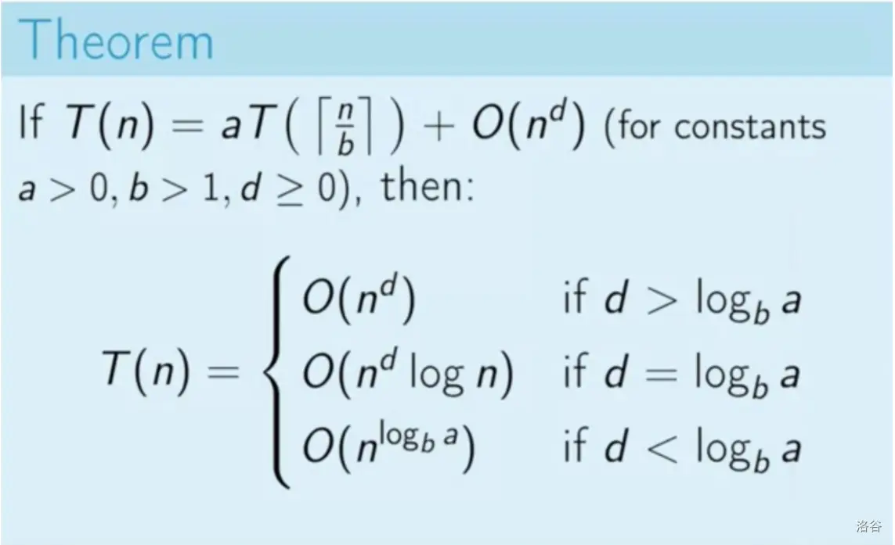

# 乱七芭蕉

## **#1**  DFS序 的性质 

- `DFS`序标号的树，按序号沿简单路径遍历一遍，恰经过每条边两次后回到根节点
- 对于`DFS`序有以下 **充要条件** ：
  - 对于其中相邻的两个节点序号 $p_i$ 与 $p_{i+1}$ ，只可能有：
    1. $p_i$ 是 $p_{i+1}$ 的父亲
    2. $p_i$ 的祖先是 $p_{i+1}$ 的父亲

## #2  语法要点

- C++ 中，**构造函数**可以被用来进行类型的**隐式转换**，当调用函数时传入的参数类型与函数参数的类型不匹配时，编译器会尝试使用构造函数将实际参数转换为目标类型。

## #3  gcd的差分性质

- $\gcd(a,b)=\gcd(a,b-a)$

- $\gcd(a_1,a_2,...,a_n)=\gcd(a_i,d_2,d_3,...d_n) , (1\le i \le n)$

## #4  数学常识

$10^9$ 以内 的数最多可能有 $f = 1344$ 个因数

## #5 前缀和相关的 Tips

- 对于连续的一段区间，若对前缀和有线性的要求，考虑直接加在区间最左侧与分次加上去是等价的

### 应用例：

牛妹正在玩多米诺骨牌。她将几张多米诺骨牌从左到右排成一排，每一张多米诺骨牌都有重量，第i张多米诺骨牌的重量记为 $a_i$。随后，牛妹定义了新的游戏规则，初始时她会选定 $l,r(1 \ge l\ge r\ge n)$ ，一轮游戏过程如下:

- 手动选择第 $l$ 张多米诺骨牌，将其向右推倒;
- 对于第 $l+1$ 张多米诺骨牌，若满足 $a_l \ge a_{l+1}$，则其也会向右倒下;
- 对于第 $l+ 2$ 张多米诺骨牌，若满足 $a_l + a_{l+1} \ge a_{l+2}$，则其也会向右倒下;
- 对于第 $i$ 张多米诺骨牌，若其左侧的第 $i-1$ 张多米诺骨牌倒下，且第 $i$ 张多米诺骨牌的重量不大于其左侧倒下的全部多米诺骨牌的重量之和，则其也向右倒下
- 对于第 $r$ 张多米诺骨牌，如果其倒下了，那么这一局游戏就是完美的。

有 $q$ 次查询

### 思路：

首先明确对于一个一次性在最左侧加上这些次之和绝不会劣于区间分多次“加”

然后定义

- 前缀和数组 $pre[i]=\sum\limits_1^n a_i$
- 只考虑 $a_i$ 的代价数组（需要在第一个上加多少）$s[i]=a_i-pre[i-1]$

然后对于区间 $l,r$ 可以视为需要在区间上先加上 $pre[l-1]$ ，假装补全前面从一开始的完整序列

然后看看这个区间里最大的 $s_i$ 就是我们需要对最开头额外加上（或减去）的量了

所以答案就是 $pre[l-1]+\max\limits_{i=l}^{r} s[i]$

## #6 曲棍球棒恒等式

曲棍球棒恒等式指出，对于非负整数 $n$ 和 $r$（$r \leq n$），有：
$$
\binom{n+1}{r+1} = \sum_{k=r}^{n} \binom{k}{r}
$$

**证明**：考虑从 $n+1$ 个元素中选取 $r+1$ 个元素的组合数。设被选元素中最大的元素为第 $k+1$ 个元素（$r \leq k \leq n$），则剩下的 $r$ 个元素必须从前 $k$ 个元素中选取，对应的组合数为 $\binom{k}{r}$。当 $k$ 从 $r$ 到 $n$ 变化时，所有可能的组合数之和即为右边的求和式：
$$
\sum_{k=r}^{n} \binom{k}{r}
$$
另一方面，从 $n+1$ 个元素中选取 $r+1$ 个元素的组合数显然为左边的 $\binom{n+1}{r+1}$。因此，等式得证。

$$
\boxed{\binom{n+1}{r+1} = \sum_{k=r}^{n} \binom{k}{r}}
$$

## #7 主定理（master定理）

