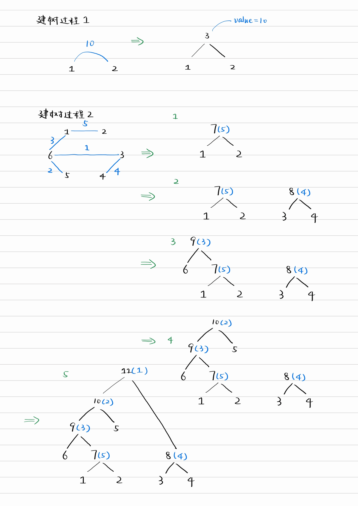

# Kruskal 重构树 学习笔记

## 前置知识

最小生成树的 Kruskal 算法、最近公共祖先（LCA）。

## 重构树

在 Kruskal 算法执行过程中（不妨设求最小生成树），我们会按边权升序依次加入若干条边。

首先初始化并查集，共 $n$ 个集合，第 $i$ 个集合初始包含且仅包含第 $i$ 个点，维护当前的连通块情况。每一次加边到最小生成树中时，我们都合并了目前的两个连通块，也就是两个集合。我们要建立重构树，在每次合并操作时新建一个点，点权为加入的这条边的边权，将合并的两个集合的根节点作为这个新建点的左右儿子，并将两个集合以及新建点合并，以新建点为集合的根（代表元）。

例如，对于下面这个无向图：

它的最小生成树的 Kruskal 重构树如下：

再附一个网上找到的解构 Kruskal 重构树 建树过程的图片（左边是图，右边是 Kruskal 重构树）：

## 重构树性质

不妨设求最小生成树，Kruskal 重构树有如下性质：

1. 重构树是一棵恰有 $n$ 个叶子节点的完满二叉树，每个非叶子节点都恰有 $2$ 个儿子，重构树的点数为 $2n−1$
2. 重构树的点权符合大根堆的性质。
3. 原图中两点间所有简单路径的最大边权最小值，等于最小生成树上两点之间边权最大值，等于重构树上两点 LCA 的点权。
4. 到点 $u$ 的简单路径上最大边权最小值 $≤k$ 的所有节点 $v$ 均在重构树上的某棵子树内，且恰为该子树内的所有叶子节点。

## 例题

###  [[P1967NOIP2013 提高组] 货车运输](https://www.luogu.com.cn/problem/P1967)

求最大生成树的重构树，所求即为重构树上 x,yx,y 两点的 LCA 的点权。

#### 解法：

- 本题可以用最大生成树+倍增做，但是这里讲一下 Kruskal 重构树的做法。

- 求最大生成树的重构树，所求即为重构树上 x,yx,y 两点的 LCA 的点权。

### [CF1706E Qpwoeirut and Vertices](https://www.luogu.com.cn/problem/CF1706E)

#### 解法：

- 以边的读入顺序为边权，求最小生成树的重构树，所求即为重构树上 l∼rl∼r 点的 LCA 点权。
- 有性质：区间 LCA 等于区间内 dfs 序最小点和最大点的 LCA。
- 使用 ST 表维护 dfs 序最小值和最大值然后求解即可。
- 需要特判 l=rl=r。

### [P4768 [NOI2018] 归程](https://www.luogu.com.cn/problem/P4768)

#### 解法：

- 转化题意，即从节点 vv 出发，先在海拔大于 pp 的边上乘车走一段，然后走最短路径回到节点 11。

- 首先通过 Dijkstra 算法预处理每个节点到节点 11 的最短路径，然后对海拔求最大生成树的重构树。

- 由上面提到的性质三和四，即求到节点 vv 最小海拔最大值大于 pp 的所有节点中，到节点 11 最近的那个点的最短路径长度。

- 在重构树上 DP 预处理每棵子树内的叶子节点中，到节点 11 最短路径长度的最小值。对于每次询问，先从 vv 开始在重构树上倍增，找到性质四所说的那棵子树，然后子树的 DP 值即为答案。
- 关于 SPFA：它死了。