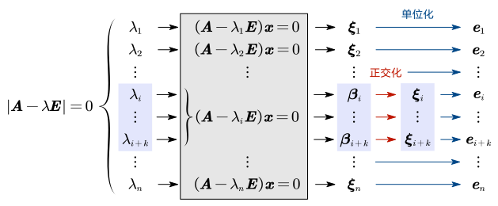

# 5.4 普通矩阵的对角化

现在回忆一下此前的相似对角化的条件：

1. 每个单根特征值，都能提供一个无关的特征向量；
2. 不同特征值的特征向量一定线性无关；
3. 如果 $n$ 阶矩阵 $\boldsymbol A$ 具有 $n$ 个不同的特征值，则矩阵一定可以相似对角化。

因此，我们判断矩阵 $\boldsymbol A$ 是否可以相似对角化，其关键就在于那些重根能否提供足够的无关向量。

## 对称矩阵的对角化

在 [2.1 中介绍矩阵概念时](../2%20矩阵/2.1%20线性方程组和矩阵#几个特殊矩阵)，我们提到过了对称矩阵的概念。

> 如果一个方阵中的所有元素关于主对角线对称，即 $\boldsymbol A=\boldsymbol A^{\rm T}$，该矩阵称为对称矩阵：
>
> $$
> \begin{pmatrix}
>   a&d&e\\
>   d&b&f\\
>   e&f&c
> \end{pmatrix}
> $$

对称矩阵的对角化有以下两个结论：

1. 实对称矩阵，一定可以相似对角化；
2. 不同特征值的特征向量一定正交（比无关更强）。

而属于同一特征值的特征向量，如果不正交，我们可以将其正交化。在此基础上，如果我们把这些特征向量单位化，我们就一定能得到一个正交矩阵 $\boldsymbol Q$，使得 $\boldsymbol Q^{-1}\boldsymbol {AQ}=\boldsymbol {\mit\Lambda}$。

::: example

设矩阵 $\boldsymbol A=\begin{pmatrix}3&-1\\-1&3\end{pmatrix}$，求正交矩阵 $\boldsymbol Q$，使得 $\boldsymbol Q^{\rm T}\boldsymbol {AQ}=\boldsymbol {\mit\Lambda}$。

对于正交矩阵 $\boldsymbol Q$，有 $\boldsymbol Q^{\rm T}=\boldsymbol Q^{-1}$。本质还是对角化。

1. 求特征值：

   $$
   |\boldsymbol A-\lambda\boldsymbol E|=0\Rightarrow\lambda_1=2,\lambda_24
   $$

2. 求特征向量：

   $$
   \left\{\begin{array}l
   (\boldsymbol A-\lambda_1\boldsymbol E)\boldsymbol x=\boldsymbol 0\Longrightarrow 基础解系:\boldsymbol \xi_1=\begin{pmatrix} 1\\1\end{pmatrix} \\
   (\boldsymbol A-\lambda_2\boldsymbol E)\boldsymbol x=\boldsymbol 0\Longrightarrow 基础解系:\boldsymbol \xi_2=\begin{pmatrix} -1\\1\end{pmatrix} \\
   \end{array} \right.
   $$

3. 正交相似对角化：$\boldsymbol \xi_1,\boldsymbol \xi_2$ 属于不同特征值的特征向量，必然正交
   $$
   \begin{gathered}
   \boldsymbol e_1=\frac{\boldsymbol \xi_1}{\|\boldsymbol \xi_1\|}
   =\frac1{\sqrt2}\begin{pmatrix}1\\1\end{pmatrix}
   =\begin{pmatrix}\frac1{\sqrt2}\\\frac1{\sqrt2} \end{pmatrix} \\
   \boldsymbol e_2=\frac{\boldsymbol \xi_2}{\|\boldsymbol \xi_2\|}
   =\frac1{\sqrt2}\begin{pmatrix}-1\\1\end{pmatrix}
   =\begin{pmatrix}-\frac1{\sqrt2}\\\frac1{\sqrt2} \end{pmatrix} \\
   \end{gathered}
   $$

因此我们有

$$
\boldsymbol Q=\begin{pmatrix}
\frac1{\sqrt2}&-\frac1{\sqrt2}\\
\frac1{\sqrt2}&\frac1{\sqrt2}
\end{pmatrix},
\boldsymbol{\mit\Lambda}=\begin{pmatrix}
2&0\\0&4
\end{pmatrix}
$$

则 $\boldsymbol Q^{\rm T}\boldsymbol {AQ}=\boldsymbol {\mit\Lambda}$。

:::
