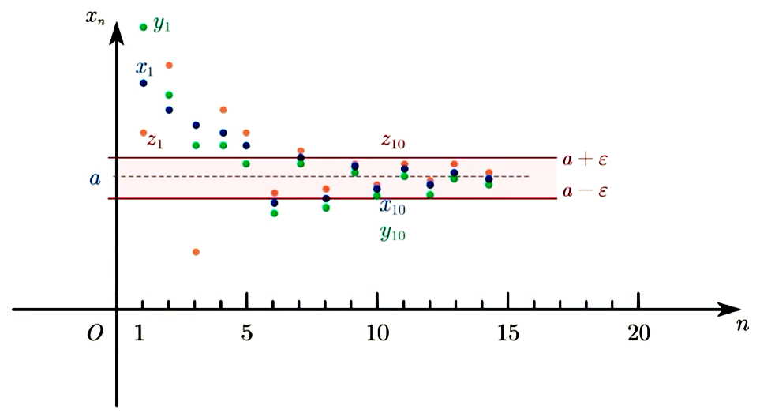

# 1.7 极限存在准则 两个重要极限

## 夹逼准则

设有数列 $\{x_n\},\{y_n\},\{z_n\}$，则
$$
\left.\begin{array}{r}
\exists N>{\bf N}_+,\forall n>N,y_n\le x_n\le z_n \\
\lim\limits_{n\to\infty}y_n=\lim\limits_{n\to\infty}z_n=a
\end{array}\right\}
\Rightarrow\lim\limits_{n\to\infty}x_n=a
$$

该准则也对函数成立：

$$
\begin{align}
\left.\begin{array}{r}
\exists \delta>0,\forall x\in\mathring U(x_0,\delta),g(x)\le f(x)\le h(x) \\
\lim\limits_{x\to x_0}g(x)=\lim\limits_{x\to x_0}h(x)=A
\end{array}\right\}
&\Rightarrow\lim\limits_{x\to x_0}f(x)=A \\

\left.\begin{array}{r}
\exists M>0,\forall |x|>M,g(x)\le f(x)\le h(x) \\
\lim\limits_{x\to \infty}g(x)=\lim\limits_{x\to \infty}h(x)=A
\end{array}\right\}
&\Rightarrow\lim\limits_{x\to \infty}f(x)=A \\
\end{align}
$$

相关的重要极限：
$$
\lim\limits_{x\to0}{\sin x\over x}=1
$$

证明思路：

$$
\sin x<x<\tan x\Rightarrow1<{x \over \sin x}<{1\over \cos x}\Rightarrow \cos x<{\sin x \over x}<1
$$

夹逼定理的更多应用，将在 [1.8\* 夹逼定理求极限专题](./1.8%20夹逼定理求极限专题) 中介绍。

## 单调有界定理

**单调有界数列必有极限。**

函数也有类似的准则，但对于自变量的不同变化过程（$x\to x_0^+,x\to x_0^-,x\to+\infty,x\to-\infty$）有不同的表现形式，如：

设函数 $f(x)$ 在点 $x_0$ 的某个左邻域内单调且有界，则 $f(x)$ 在 $x_0$ 的左极限 $f(x_0^-)$ 必存在。

相关的重要极限：

$$
\lim\limits_{x\to\infty}\left(1+{1\over x}\right)^x=e
$$

> [!tip]
>
> **此极限非常重要**！求底数和指数都出现 $x$ 的极限，其本质基本都是配凑成这个极限求解。详见 [3.3\* 极限计算专题](../3%20导数的应用/3.3%20极限计算专题#_1-的无穷次方型)

现证明 $x_n=\left(1+\frac1n\right)^n$ 收敛。

采用均值不等式：

$$
\sqrt[n]{x_1+x_2+\cdots x_n} \le{x_1+x_2+\cdots+x_n \over n}
$$

单调：

$$
\begin{align}
x_n=\left(1+\frac1n\right)^n&=\overbrace{\left(1+\frac1n\right)\left(1+\frac1n\right)\cdots\left(1+\frac1n\right)}^{n个}\times1 \\
&< \left[n\left(1+\frac1n\right)+1\over n+1\right]^{n+1} \\
&=\left(1+\frac1{n+1}\right)^{n+1} \\
&=x_{n+1}
\end{align}
$$

有界：

$$
\begin{align}
x_n&=4\left[\overbrace{\left(1+\frac1n\right)\cdot\left(1+\frac1n\right)\cdots\left(1+\frac1n\right)}^{n个}\times\frac12\times\frac12\right] \\
&<4\left[n\left(1+\frac1n\right)+\frac12+\frac12 \over n+2\right]^{n+2} \\
&=4
\end{align}
$$

证毕。

---

**例** 证明 $x_n={1\over n+1}+{1\over n+2}+\cdots+{1\over 2x}$ 收敛。

单调：

$$
x_{n+1}-x_n={1\over 2n+1}+{1\over 2n+2}-{1\over n+1}={1\over 2n+1}-{1\over 2n+2}>0
$$

有界：

$$
x_n={1\over n+1}+{1\over n+2}+\cdots+{1\over 2n}<n\cdot\frac1n=1
$$

证毕。

## 柯西极限存在准则

数列 $\{x_n\}$ 收敛的**充分必要**条件是：对于任意给定的正数 $\varepsilon$，存在正整数 $N$，使得当 $m>N,n>N$ 时有 $|x_n-x_m|<\varepsilon$。

$$
\exists \lim\limits_{n\to\infty}x_n \Leftrightarrow \forall\varepsilon>0,\exists N\in {\bf N}_+,\exists m,n>N,|x_n-x_m|<\varepsilon
$$

该准则也称柯西审敛原理。

---

**例 1** 设 $x_1=1,x_{n+1}=\frac1{1+x_n}$，求 $\lim\limits_{n\to\infty}x_n$。

> [!tip]
>
> 假设这个极限存在，记为 $a$，那应该有
> $$
> a={1\over1+a}
> $$
> 解得 $a=\frac{\sqrt 5-1}2$。接下来只要证明其极限确实是 $a$ 就可以了。

取 $a=\frac{\sqrt 5-1}2$，则有 $a=\frac1{1+a}$。

$$
\begin{align}&
\hspace{24mu}|x_{n+1}-a| \\&
=\left|\frac1{1+x_n}-\frac1{1+a}\right|
=\left|{a-x_n\over(1+x_n)(1+a)}\right|
=\left|{a-x_n\over\frac{\sqrt5+1}2(1+x_n)}\right| \\&
\le\frac2{\sqrt5-1}|x_n-a|
\le\left(\frac2{\sqrt5-1}\right)^2|x_{n-1}-a|
\le\cdots
\le\left(\frac2{\sqrt5-1}\right)^n|x_1-a| \\&
=\frac{3-\sqrt5}2\cdot\left(\frac2{\sqrt5-1}\right)^n \to0 \quad (n\to\infty) \\&
\Rightarrow \lim\limits_{n\to\infty}x_n=a
\end{align}
$$

故有 $\lim\limits_{n\to\infty}x_n=\frac{\sqrt 5-1}2$。

> [!tip]
>
> 总结经验：类似这样的数列
> $$
> x_n={mx_{n-1}+k\over ax_{n-1}+b}
> $$
> 求极限时，都可以试着用此法处理。

---

**例 2** 设 $x_n=1+\frac12+\frac13+\cdots+\frac1n$，利用柯西审敛定理证明 $\{x_n\}$ 发散。

> [!tip]
>
> 柯西审敛原则是判断数列收敛的**充要**条件。因此只需要证明该数列满足其否命题：
>
> $$
> \exists\varepsilon_0>0,\forall N\in {\bf N}_+,\exists m,n> N,|x_n-x_m|\ge\varepsilon_0
> $$

取 $n=2m,m>N$，有

$$
x_n-x_m=x_{2m}-x_m=\frac1{m+1}+\frac1{m+2}+\cdots+\frac1{2m}\ge\frac1{2m}\cdot m=\frac12
$$

则取 $\varepsilon_0=\frac12$，该数列符合柯西审敛原则的否命题，故 $\{x_n\}$ 发散，证毕。

---

**例 3** 设 $\lim\limits_{x\to\infty}x_n=a$，证明 $\lim\limits_{n\to\infty}{x_1+x_2+\cdots+x_n\over n}=a$。
$$
\lim_{x\to\infty}x_n=a\Rightarrow\forall\varepsilon>0,\exists {N_1}\in{\bf N}_+,\forall n>{N_1},|x_n-a|<\frac\varepsilon2 \\
\Rightarrow|x_{{N_1}+k}-a|<\frac\varepsilon2
$$

$n>{N_1}$ 时有

$$
\begin{align}
&\:\left|{x_1+x_2+\cdots+x_n\over n}-a\right|=\left|{x_1+x_2+\cdots+x_n-na\over n}\right| \\
=&\:\left|{x_1+x_2+\cdots+x_{N_1}-{N_1}a\over n}+{(x_{N_1}-a)+(x_{{N_1}+1}-a)+\cdots+(x_n-a)\over n}\right| \\
\le&\:{|x_1+x_2+\cdots+x_{N_1}-{N_1}a|\over n}+\frac1n(|x_{N_1}-a|+|x_{{N_1}+1}-a|+\cdots+|x_n-a|) \\
<&\:\frac Mn+{n-{N_1}\over n}\cdot\frac\varepsilon2<\frac Mn+\frac\varepsilon2
\end{align}
$$

其中 $M=|x_1+x_2+\cdots+x_{N_1}-{N_1}a|$ 为常数。

取正数 ${N_2}\ge{2M\over\varepsilon}$，则当 $n>N_2$ 时有 $\frac Mn<\frac\varepsilon2$。

取 $N=\max\{N_1,N_2\}$，当 $n>N$ 时，有

$$
\left|{x_1+x_2+\cdots+x_n\over n}-a\right|<\frac Mn+\frac\varepsilon2<\varepsilon
$$

因此有 $\lim\limits_{n\to\infty}{x_1+x_2+\cdots+x_n\over n}=a$。证毕。
