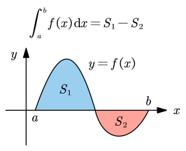

# 5.1 定积分的概念与性质

## 引入

例如我们要求一个函数 $y=f(x)$（$f(x)\ge0$）在 $[a,b]$ 上的图线与 $x$ 轴围成的图形面积 $S$（该形状也称为**曲边梯形**，因为相比于梯形，有一条边是曲线）。

我们把曲线 $[a,b]$ 分解成 $n$ 个小区间：

$$
\begin{gathered}[]
[a,b]=\bigcup_{i=1}^n[x_{i-1},x_i] \\
(x_0=a<x_1<x_2<\cdots<x_n-1<x_n=b)
\end{gathered}
$$

每个小区间的长度，我们将其记为

$$
\Delta x_i=x_i-x_{i-1},\quad\small{i=1,2,\cdots,n}
$$

这样，这个大的曲边梯形就被我们分割成了 $n$ 个小的曲边梯形。我们将第 $i$ 个曲边梯形的面积记作 $\Delta S_i$，那么有

$$
S=\sum_{i=1}^n\Delta S_i
$$

可是小的曲边梯形的面积如何计算？我们做一个近似。在第 $i$ 个区间内取一个值 $\xi_i$，用宽为 $\Delta x_i$，高为 $f(\xi_i)$ 的矩形的面积来近似替换第 $i$ 个小曲边梯形的面积 $\Delta S_i$。写成符号语言就是

$$
取\,\xi_i\in[x_{i-1},x_i]\Rightarrow\Delta S_i\doteq f(\xi_i)\Delta x_i\quad\small{i=1,2,\cdots,n}
$$

因此我们有

$$
S=\sum_{i=1}^n\Delta S_i\doteq \sum_{i=1}^n f(\xi_i)\Delta x_i
$$

我们记 $\lambda=\max\{\Delta x_i\}$，那么

$$
S=\lim_{\lambda\to0}\sum_{i=1}^nf(\xi_i)\Delta x_i
$$

## 定积分的定义

设函数 $f(x)$ 在 $[a,b]$ 上**有界**，我们在 $[a,b]$ 中任意插入若干个分点：

$$
a=x_0<x_1<x_2<\cdots<x_{n-1}<x_n=b
$$

将 $[a,b]$ 分成 $n$ 个小区间：

$$
\begin{gathered}[]
[a,b]=\bigcup_{i=1}^n[x_{i-1},x_i] \\

\end{gathered}
$$

记各区间的长度为 $\Delta x_i=x_i-x_{i-1}$，在各个区间内任取 $\xi_i\in[x_{i-1},x_i]$，记区间长度的最大值 $\lambda=\max\limits_{1\le i\le n}\{\Delta x_i\}$，有极限

$$
\lim_{\lambda\to0}\sum_{i=1}^nf(\xi_i)\Delta x_i
$$

存在，称 $f(x)$ 在 $[a,b]$ 上**可积**，称该极限的值为 $f(x)$ 在 $[a,b]$ 上的**定积分值**，记作：

$$
\int_a^bf(x){\rm d}x
$$

其中，$a$ 称为**积分下限**，$b$ 称为**积分上限**。

> [!tip]
>
> 该定义可以用于求极限，因此需要掌握。

按照上面的定义，$a<b$。这里额外做出两个规定：

- $$
  \int_a^af(x){\rm d}x=0
  $$

- 当 $a>b$ 时，规定
  $$
  \int_a^bf(x){\rm d}x=\int_b^af(x){\rm d}x
  $$

因此，此后遇到定积分时，不需要验证上下界的大小关系。

> [!note]
>
> **定积分的几何意义**
>
> 定积分 $\int_a^bf(x){\rm d}x$ 在几何上表示曲线 $y=f(x)$ 和直线 $x=a$，$x=b$ 以及 $x$ 轴围成各部分中，$x$ 轴上方图形面积之和减去 $x$ 轴下方图形面积之和。
>
> 
>
> 注：有些教材中使用「各部分面积的代数和」这一说法，实质上是引入了「有向面积」，即面积可取负值。

这里举一个用定义计算定积分的例子。

::: example

利用定义计算定积分

$$
\int_0^1x^2{\rm d}x
$$

因为被积函数 $f(x) = x^2$ 在积分区间 $[0, 1]$ 上连续，而连续函数是可积的，所以积分与区间 $[0, 1]$ 的分法及点 $\xi_i$ 的取法无关。因此，为了便于计算，不妨把区间 $[0, 1]$ 分成 $n$ 等份，分点为 $x_i=\dfrac in$（$i=1,2,\cdots,n-1$）。这样，每个区间 $[x_{i-1},x_i]$ 的长度 $\Delta x_i=\dfrac1n$（$i=1,2,\cdots,n$）。取 $\xi_i=x_i$（$i=1,2,\cdots,n$）。于是，得到

$$
\sum_{i=1}^nf(\xi_i)\Delta x_i=\sum_{i=1}^n\xi_i^2\Delta x_i=\sum_{i=1}^n\left(\frac in\right)^2\cdot\frac1n=\frac1{n^3}\sum_{i=1}^ni^2
$$

:::

## 与可积相关的条件

### 可积的充分条件

- 若 $f(x)$ 在闭区间上连续，则其在区间上可积。
- 若 $f(x)$ 在闭区间上有界，且只有有限个间断点，那么 $f(x)$ 在区间上是可积的。

这里不给证明。教材上也没有，要数学专业才能证。

### 可积的必要条件

若函数 $f(x)$ 在区间 $[a,b]$ 上可积，则 $f(x)$ 在 $[a,b]$ 上必有界。（这个是在定义里面写明的）。

但是闭区间上有界的函数不一定可积。例如狄利克雷函数：

$$
D(x) = \left\{\begin{array}l1, & x \in {\bf{Q}} \\ 0, & x \in {{\bf{Q}}^C}\end{array}\right.
$$

在 $[0,1]$ 上有界但不可积。

::: details 证明过程

$|D(x)|\le1$，故 $D(x)$ 有界。

思路：找到两种不同的分割方法，使得累加求和的结果不同，即可证明其不可积。

将 $[0,1]$ 分成 $n$ 份，每段长度为 $\Delta x_i$（$i=1,2,\cdots,n$），若 $D(x)$ 在 $[0,1]$ 上可积，则

$$
\lim_{\lambda\to0}\sum_{i=1}^nD(\xi_i)\Delta x_i=I
$$

当 $\xi_i$ 均取有理数，则

$$
\lim_{\lambda\to0}\sum_{i=1}^n1\cdot\Delta x_i=1
$$

当 $\xi_i$ 均取无理数，则

$$
\lim_{\lambda\to0}\sum_{i=1}^n0\cdot\Delta x_i=0
$$

两个极限不相等。故 $D(x)$ 在 $[0,1]$ 上不可积。

:::

## 定积分的基本性质

> 假设以下定积分都存在，且不做特殊说明，不限制 $a$ 与 $b$ 的大小关系； 证明用定积分定义，直观理解用几何意义。

### 线性性

$$
\begin{gathered}
\int_a^b[f(x)\pm g(x)]{\rm d}x=\int_a^bf(x){\rm d}x\pm\int_a^bg(x){\rm d}x\\
\int_a^bkf(x){\rm d}x=k\int_a^bf(x){\rm d}x
\end{gathered}
$$

这个性质本质是极限的四则运算性质。

该性质中，区间不变，操作的是被积函数。

### 可加性

$\forall c\in{\bf R}$，总有

$$
\int_a^bf(x){\rm d}x=\int_a^cf(x){\rm d}x+\int_c^bf(x){\rm d}x
$$

> [!warning]
>
> 注意这里**不要求** $c\in[a,b]$。

该性质中，被积函数不变，操作的是区间。

### 常数的定积分

$$
\int_a^b1{\rm d}x=b-a
$$

### 大小关系

若 $\forall x\in[a,b]$，都有 $f(x)\le g(x)$，就有

$$
\int_a^bf(x){\rm d}x\le\int_a^bg(x){\rm d}x
$$

### 绝对值的比较

$$
\left|\int_a^bf(x){\rm d}x\right|\le \int_a^b\left|f(x) \right|\,{\rm d}x
$$

### 估值定理

设 $\forall x\in[a,b]$，都有 $m\le f(x)\le M$，则

$$
m(b-a)\le \int_a^bf(x){\rm d}x \le M(b-a)
$$

### 定积分中值定理

设 $f(x)$ 在 $[a,b]$ 上连续，则 $\exists \xi\in(a,b)$ 使得

$$
\int_a^bf(x){\rm d}x=(b-a)\cdot f(\xi)
$$

> [!note]
>
> 定积分的近似计算部分，考试不要求。
